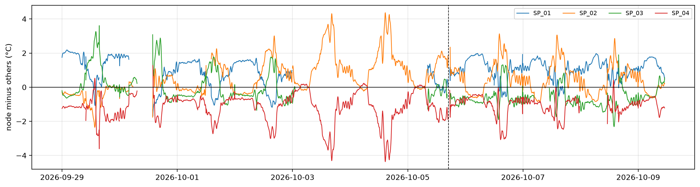
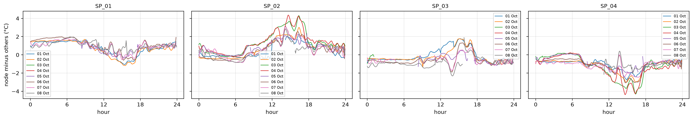
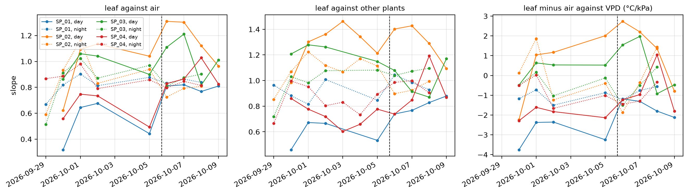
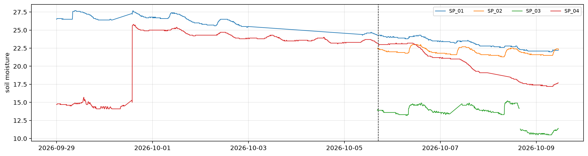

# Batch 2: water stress diagnosis


<!-- WARNING: THIS FILE WAS AUTOGENERATED! DO NOT EDIT! -->

Batch 2 is the SD-card dump collected on 9 October. It contains all of
batch 1, from 23 September, plus the period from 5 October at about
17:00 to 9 October at 11:00. In that new period, the team water-stressed
one of the four plants without saying which. This notebook tries to find
it from the data. Batch 1 days serve as each plant’s baseline.

The thermal signals use the unmasked leaf temperature. The variance
masks are not reliable yet. 9 October has data only until 11:00, so
daily statistics stop at 8 October.

``` python
import numpy as np, pandas as pd, matplotlib.pyplot as plt
from pathlib import Path
from speaking_plants.clean import *
from speaking_plants.leaf import *
from speaking_plants.logbook import *
```

``` python
mdf = share_ruuvi(measurements(clean(read_logs(sorted(Path('../../../data/b02').glob('dados_*.csv'))))))
us = leaf_series(mdf, no_masks(full_days(mdf, min_n=13)))
start_new = pd.Timestamp('2026-10-05 17:00')
```

## Leaf temperature relative to the other plants

All plants share the greenhouse climate. `peers` gives the mean of the
other three plants. Subtracting it from each plant’s smoothed leaf
temperature removes the shared climate, and needs no air sensor. A plant
that transpires less warms relative to the others, most at midday and in
the afternoon. The dashed line marks the start of the new period:

``` python
tl = node_table(us, 't_smooth')
rel = tl - peers(tl)
r = rel.loc['2026-09-29':]
fig, ax = plt.subplots(figsize=(16, 4))
for n in r: ax.plot(r.index, r[n], lw=1, label=n)
ax.axhline(0, c='k', lw=0.8); ax.axvline(start_new, c='k', ls='--', lw=0.8)
ax.set_ylabel('node minus others (°C)'); ax.grid(alpha=0.3); ax.legend(fontsize=8, ncol=4)
```



The same difference by time of day, one line per day from 1 October,
when the camera scenes had settled after the change on 30 September:

``` python
long = rel.loc['2026-10-01':'2026-10-08'].stack().rename('rel').reset_index().rename(columns={'t': 'time'})
long = long.assign(day=long.time.dt.normalize(), hour=(long.time - long.time.dt.normalize()).dt.total_seconds() / 3600)
plot_panels(long, 'rel', ylabel='node minus others (°C)')
```



## Daily indicators

Four numbers per plant and day:

- midday leaf minus air, from 11:00 to 15:00, on the days with Ruuvi
  readings,
- midday leaf temperature minus the mean of the other plants,
- the daily swing of the smoothed leaf temperature, with the air’s swing
  for reference,
- afternoon (13:00 to 16:00) minus morning (09:00 to 12:00) of the
  difference to the other plants. Stomata that close as the day goes on
  make this rise.

``` python
air = node_table(us, 't_air').mean(axis=1)
h, day = tl.index.hour, tl.index.normalize()
span = (day >= '2026-09-29') & (day < '2026-10-09')
mid, am, pm = (h >= 11) & (h < 15), (h >= 9) & (h < 12), (h >= 13) & (h < 16)
daily = lambda w: w.groupby(lambda t: t.normalize()).mean().rename(index=lambda d: f'{d:%d %b}').round(2)
swing = lambda s: s.max() - s.min() if s.notna().sum() > 250 else np.nan
ind = {'midday leaf - air': daily(tl.sub(air, axis=0)[mid & span]),
       'midday node - others': daily(rel[mid & span]),
       'daily swing': tl[span].groupby(lambda t: t.normalize()).agg(swing).assign(air=air[span].groupby(lambda t: t.normalize()).agg(swing)).rename(index=lambda d: f'{d:%d %b}').round(1),
       'afternoon - morning': (daily(rel[pm & span]) - daily(rel[am & span])).round(2)}
pd.concat(ind, axis=1)
```

<div>
<style scoped>
    .dataframe tbody tr th:only-of-type {
        vertical-align: middle;
    }
&#10;    .dataframe tbody tr th {
        vertical-align: top;
    }
&#10;    .dataframe thead tr th {
        text-align: left;
    }
&#10;    .dataframe thead tr:last-of-type th {
        text-align: right;
    }
</style>

<table class="dataframe" data-quarto-postprocess="true" data-border="1">
<thead>
<tr>
<th data-quarto-table-cell-role="th"></th>
<th colspan="4" data-quarto-table-cell-role="th"
data-halign="left">midday leaf - air</th>
<th colspan="4" data-quarto-table-cell-role="th"
data-halign="left">midday node - others</th>
<th colspan="5" data-quarto-table-cell-role="th"
data-halign="left">daily swing</th>
<th colspan="4" data-quarto-table-cell-role="th"
data-halign="left">afternoon - morning</th>
</tr>
<tr>
<th data-quarto-table-cell-role="th">node_id</th>
<th data-quarto-table-cell-role="th">SP_01</th>
<th data-quarto-table-cell-role="th">SP_02</th>
<th data-quarto-table-cell-role="th">SP_03</th>
<th data-quarto-table-cell-role="th">SP_04</th>
<th data-quarto-table-cell-role="th">SP_01</th>
<th data-quarto-table-cell-role="th">SP_02</th>
<th data-quarto-table-cell-role="th">SP_03</th>
<th data-quarto-table-cell-role="th">SP_04</th>
<th data-quarto-table-cell-role="th">SP_01</th>
<th data-quarto-table-cell-role="th">SP_02</th>
<th data-quarto-table-cell-role="th">SP_03</th>
<th data-quarto-table-cell-role="th">SP_04</th>
<th data-quarto-table-cell-role="th">air</th>
<th data-quarto-table-cell-role="th">SP_01</th>
<th data-quarto-table-cell-role="th">SP_02</th>
<th data-quarto-table-cell-role="th">SP_03</th>
<th data-quarto-table-cell-role="th">SP_04</th>
</tr>
<tr>
<th data-quarto-table-cell-role="th">t</th>
<th data-quarto-table-cell-role="th"></th>
<th data-quarto-table-cell-role="th"></th>
<th data-quarto-table-cell-role="th"></th>
<th data-quarto-table-cell-role="th"></th>
<th data-quarto-table-cell-role="th"></th>
<th data-quarto-table-cell-role="th"></th>
<th data-quarto-table-cell-role="th"></th>
<th data-quarto-table-cell-role="th"></th>
<th data-quarto-table-cell-role="th"></th>
<th data-quarto-table-cell-role="th"></th>
<th data-quarto-table-cell-role="th"></th>
<th data-quarto-table-cell-role="th"></th>
<th data-quarto-table-cell-role="th"></th>
<th data-quarto-table-cell-role="th"></th>
<th data-quarto-table-cell-role="th"></th>
<th data-quarto-table-cell-role="th"></th>
<th data-quarto-table-cell-role="th"></th>
</tr>
</thead>
<tbody>
<tr>
<td data-quarto-table-cell-role="th">29 Sep</td>
<td>0.98</td>
<td>-0.16</td>
<td>2.46</td>
<td>0.12</td>
<td>0.18</td>
<td>-1.35</td>
<td>2.15</td>
<td>-0.97</td>
<td>8.1</td>
<td>8.8</td>
<td>11.5</td>
<td>10.1</td>
<td>9.8</td>
<td>-1.04</td>
<td>-0.10</td>
<td>1.50</td>
<td>-0.38</td>
</tr>
<tr>
<td data-quarto-table-cell-role="th">30 Sep</td>
<td>-1.69</td>
<td>-0.55</td>
<td>0.16</td>
<td>-1.64</td>
<td>-1.09</td>
<td>0.43</td>
<td>1.40</td>
<td>-0.79</td>
<td>NaN</td>
<td>NaN</td>
<td>NaN</td>
<td>NaN</td>
<td>NaN</td>
<td>NaN</td>
<td>NaN</td>
<td>NaN</td>
<td>NaN</td>
</tr>
<tr>
<td data-quarto-table-cell-role="th">01 Oct</td>
<td>0.11</td>
<td>0.65</td>
<td>0.66</td>
<td>-1.15</td>
<td>0.21</td>
<td>0.77</td>
<td>0.99</td>
<td>-1.57</td>
<td>7.1</td>
<td>10.1</td>
<td>10.2</td>
<td>7.6</td>
<td>8.5</td>
<td>-1.37</td>
<td>1.92</td>
<td>1.29</td>
<td>-1.20</td>
</tr>
<tr>
<td data-quarto-table-cell-role="th">02 Oct</td>
<td>0.06</td>
<td>1.53</td>
<td>0.41</td>
<td>-1.26</td>
<td>-0.16</td>
<td>1.79</td>
<td>0.30</td>
<td>-1.93</td>
<td>7.3</td>
<td>10.8</td>
<td>10.5</td>
<td>7.5</td>
<td>8.4</td>
<td>-1.51</td>
<td>1.44</td>
<td>1.49</td>
<td>-1.38</td>
</tr>
<tr>
<td data-quarto-table-cell-role="th">03 Oct</td>
<td>NaN</td>
<td>NaN</td>
<td>NaN</td>
<td>NaN</td>
<td>NaN</td>
<td>2.79</td>
<td>NaN</td>
<td>-2.79</td>
<td>NaN</td>
<td>10.7</td>
<td>NaN</td>
<td>7.4</td>
<td>NaN</td>
<td>NaN</td>
<td>1.76</td>
<td>NaN</td>
<td>-1.76</td>
</tr>
<tr>
<td data-quarto-table-cell-role="th">04 Oct</td>
<td>NaN</td>
<td>NaN</td>
<td>NaN</td>
<td>NaN</td>
<td>NaN</td>
<td>2.62</td>
<td>NaN</td>
<td>-2.62</td>
<td>NaN</td>
<td>11.9</td>
<td>NaN</td>
<td>9.7</td>
<td>NaN</td>
<td>NaN</td>
<td>1.55</td>
<td>NaN</td>
<td>-1.55</td>
</tr>
<tr>
<td data-quarto-table-cell-role="th">05 Oct</td>
<td>0.88</td>
<td>2.09</td>
<td>0.74</td>
<td>-0.36</td>
<td>0.06</td>
<td>1.67</td>
<td>-0.13</td>
<td>-1.60</td>
<td>NaN</td>
<td>9.4</td>
<td>NaN</td>
<td>6.7</td>
<td>NaN</td>
<td>-0.85</td>
<td>0.98</td>
<td>0.46</td>
<td>-0.60</td>
</tr>
<tr>
<td data-quarto-table-cell-role="th">06 Oct</td>
<td>1.46</td>
<td>2.30</td>
<td>0.52</td>
<td>-0.16</td>
<td>0.57</td>
<td>1.70</td>
<td>-0.67</td>
<td>-1.58</td>
<td>8.3</td>
<td>11.6</td>
<td>9.8</td>
<td>9.2</td>
<td>8.6</td>
<td>-0.73</td>
<td>1.29</td>
<td>0.43</td>
<td>-1.01</td>
</tr>
<tr>
<td data-quarto-table-cell-role="th">07 Oct</td>
<td>1.20</td>
<td>2.20</td>
<td>0.41</td>
<td>-0.21</td>
<td>0.40</td>
<td>1.74</td>
<td>-0.66</td>
<td>-1.48</td>
<td>8.4</td>
<td>10.4</td>
<td>NaN</td>
<td>9.5</td>
<td>8.6</td>
<td>-0.73</td>
<td>1.42</td>
<td>-0.02</td>
<td>-0.38</td>
</tr>
<tr>
<td data-quarto-table-cell-role="th">08 Oct</td>
<td>0.95</td>
<td>1.70</td>
<td>-0.28</td>
<td>-0.17</td>
<td>0.54</td>
<td>1.54</td>
<td>-1.10</td>
<td>-1.01</td>
<td>8.7</td>
<td>11.3</td>
<td>8.3</td>
<td>NaN</td>
<td>8.9</td>
<td>-0.60</td>
<td>1.39</td>
<td>-0.05</td>
<td>-0.04</td>
</tr>
</tbody>
</table>

</div>

## Daily fits

`daily_fits` fits each plant’s smoothed leaf temperature against a
reference, separately for each day and for each night. Three references:

- air temperature: a well-transpiring leaf warms more slowly than the
  air by day, with a slope below 1,
- the mean of the other plants, from `peers`: a plant that closes its
  stomata warms faster than the others, and its slope rises,
- VPD, for leaf minus air: a transpiring leaf cools further below the
  air as VPD rises, which gives a negative slope. The slope moves
  towards 0, or above, when transpiration stops.

The fits start on 30 September, after the scene change. On 7 October
`SP_03` and on 8 October `SP_04` restarted in the morning, so those day
fits cover only the afternoon:

``` python
w = tl.loc['2026-09-30':]
vp = node_table(us, 'vpd').mean(axis=1)
fits = {'leaf against air': daily_fits(w, air), 'leaf against other plants': daily_fits(w, peers(w)),
        'leaf minus air against VPD (°C/kPa)': daily_fits(node_table(us, 'dt_smooth').loc['2026-09-30':], vp)}
fig, axs = plt.subplots(1, 3, figsize=(16, 4), sharex=True)
for ax, (k, f) in zip(axs, fits.items()):
    for (n, reg), g in f.groupby(['node_id', 'regime']):
        ax.plot(g.day, g.slope, marker='o', ms=3, lw=1, ls='-' if reg == 'day' else ':', c=f'C{int(n[-1]) - 1}', label=f'{n}, {reg}')
    ax.axvline(start_new, c='k', ls='--', lw=0.8); ax.set_title(k, fontsize=10); ax.grid(alpha=0.3)
axs[0].set_ylabel('slope'); axs[0].legend(fontsize=7, ncol=2); fig.autofmt_xdate()
```



The day slopes as a table:

``` python
pd.concat({k: f[f.regime == 'day'].pivot(index='day', columns='node_id', values='slope') for k, f in fits.items()}, axis=1).rename(index=lambda d: f'{d:%d %b}').round(2)
```

    Pandas4Warning: Sorting by default when concatenating all DatetimeIndex is deprecated.  In the future, pandas will respect the default of `sort=False`. Specify `sort=True` or `sort=False` to silence this message. If you see this warnings when not directly calling concat, report a bug to pandas.
      pd.concat({k: f[f.regime == 'day'].pivot(index='day', columns='node_id', values='slope') for k, f in fits.items()}, axis=1).rename(index=lambda d: f'{d:%d %b}').round(2)

<div>
<style scoped>
    .dataframe tbody tr th:only-of-type {
        vertical-align: middle;
    }
&#10;    .dataframe tbody tr th {
        vertical-align: top;
    }
&#10;    .dataframe thead tr th {
        text-align: left;
    }
&#10;    .dataframe thead tr:last-of-type th {
        text-align: right;
    }
</style>

<table class="dataframe" data-quarto-postprocess="true" data-border="1">
<thead>
<tr>
<th data-quarto-table-cell-role="th"></th>
<th colspan="4" data-quarto-table-cell-role="th" data-halign="left">leaf
against air</th>
<th colspan="4" data-quarto-table-cell-role="th" data-halign="left">leaf
against other plants</th>
<th colspan="4" data-quarto-table-cell-role="th" data-halign="left">leaf
minus air against VPD (°C/kPa)</th>
</tr>
<tr>
<th data-quarto-table-cell-role="th">node_id</th>
<th data-quarto-table-cell-role="th">SP_01</th>
<th data-quarto-table-cell-role="th">SP_02</th>
<th data-quarto-table-cell-role="th">SP_03</th>
<th data-quarto-table-cell-role="th">SP_04</th>
<th data-quarto-table-cell-role="th">SP_01</th>
<th data-quarto-table-cell-role="th">SP_02</th>
<th data-quarto-table-cell-role="th">SP_03</th>
<th data-quarto-table-cell-role="th">SP_04</th>
<th data-quarto-table-cell-role="th">SP_01</th>
<th data-quarto-table-cell-role="th">SP_02</th>
<th data-quarto-table-cell-role="th">SP_03</th>
<th data-quarto-table-cell-role="th">SP_04</th>
</tr>
<tr>
<th data-quarto-table-cell-role="th">day</th>
<th data-quarto-table-cell-role="th"></th>
<th data-quarto-table-cell-role="th"></th>
<th data-quarto-table-cell-role="th"></th>
<th data-quarto-table-cell-role="th"></th>
<th data-quarto-table-cell-role="th"></th>
<th data-quarto-table-cell-role="th"></th>
<th data-quarto-table-cell-role="th"></th>
<th data-quarto-table-cell-role="th"></th>
<th data-quarto-table-cell-role="th"></th>
<th data-quarto-table-cell-role="th"></th>
<th data-quarto-table-cell-role="th"></th>
<th data-quarto-table-cell-role="th"></th>
</tr>
</thead>
<tbody>
<tr>
<td data-quarto-table-cell-role="th">30 Sep</td>
<td>0.32</td>
<td>0.62</td>
<td>0.86</td>
<td>0.56</td>
<td>0.46</td>
<td>0.98</td>
<td>1.21</td>
<td>0.86</td>
<td>-3.76</td>
<td>-2.24</td>
<td>-0.48</td>
<td>-2.29</td>
</tr>
<tr>
<td data-quarto-table-cell-role="th">01 Oct</td>
<td>0.64</td>
<td>1.09</td>
<td>1.06</td>
<td>0.75</td>
<td>0.67</td>
<td>1.30</td>
<td>1.28</td>
<td>0.78</td>
<td>-2.37</td>
<td>1.04</td>
<td>0.63</td>
<td>-1.61</td>
</tr>
<tr>
<td data-quarto-table-cell-role="th">02 Oct</td>
<td>0.68</td>
<td>1.13</td>
<td>1.04</td>
<td>0.73</td>
<td>0.67</td>
<td>1.36</td>
<td>1.26</td>
<td>0.72</td>
<td>-2.36</td>
<td>1.17</td>
<td>0.53</td>
<td>-1.83</td>
</tr>
<tr>
<td data-quarto-table-cell-role="th">03 Oct</td>
<td>NaN</td>
<td>NaN</td>
<td>NaN</td>
<td>NaN</td>
<td>NaN</td>
<td>1.46</td>
<td>NaN</td>
<td>0.60</td>
<td>NaN</td>
<td>NaN</td>
<td>NaN</td>
<td>NaN</td>
</tr>
<tr>
<td data-quarto-table-cell-role="th">04 Oct</td>
<td>NaN</td>
<td>NaN</td>
<td>NaN</td>
<td>NaN</td>
<td>NaN</td>
<td>1.34</td>
<td>NaN</td>
<td>0.66</td>
<td>NaN</td>
<td>NaN</td>
<td>NaN</td>
<td>NaN</td>
</tr>
<tr>
<td data-quarto-table-cell-role="th">05 Oct</td>
<td>0.44</td>
<td>1.04</td>
<td>0.90</td>
<td>0.49</td>
<td>0.53</td>
<td>1.21</td>
<td>1.15</td>
<td>0.78</td>
<td>-3.25</td>
<td>2.01</td>
<td>0.52</td>
<td>-2.13</td>
</tr>
<tr>
<td data-quarto-table-cell-role="th">06 Oct</td>
<td>0.81</td>
<td>1.31</td>
<td>1.11</td>
<td>0.83</td>
<td>0.74</td>
<td>1.40</td>
<td>1.08</td>
<td>0.74</td>
<td>-1.18</td>
<td>2.73</td>
<td>1.54</td>
<td>-1.23</td>
</tr>
<tr>
<td data-quarto-table-cell-role="th">07 Oct</td>
<td>0.82</td>
<td>1.30</td>
<td>1.21</td>
<td>0.86</td>
<td>0.77</td>
<td>1.43</td>
<td>0.91</td>
<td>0.85</td>
<td>-1.31</td>
<td>2.20</td>
<td>1.97</td>
<td>-0.97</td>
</tr>
<tr>
<td data-quarto-table-cell-role="th">08 Oct</td>
<td>0.77</td>
<td>1.12</td>
<td>0.82</td>
<td>1.03</td>
<td>0.83</td>
<td>1.29</td>
<td>0.87</td>
<td>1.19</td>
<td>-1.80</td>
<td>1.36</td>
<td>-0.92</td>
<td>1.04</td>
</tr>
<tr>
<td data-quarto-table-cell-role="th">09 Oct</td>
<td>0.81</td>
<td>0.96</td>
<td>1.01</td>
<td>0.83</td>
<td>0.88</td>
<td>1.09</td>
<td>1.17</td>
<td>0.87</td>
<td>-2.12</td>
<td>-0.79</td>
<td>-0.47</td>
<td>-1.80</td>
</tr>
</tbody>
</table>

</div>

## Soil moisture

Soil moisture is the closest thing to an answer key, so it comes last.
All four soil sensors work in the new period. Their readings are not
calibrated against each other, so the trend of each sensor matters more
than its level:

``` python
s = mdf[mdf.time >= '2026-09-29']
fig, ax = plt.subplots(figsize=(16, 4))
for n, g in s.groupby('node_id'): ax.plot(g.time, g.soil_moisture, lw=1, label=n)
ax.axvline(start_new, c='k', ls='--', lw=0.8); ax.set_ylabel('soil moisture'); ax.grid(alpha=0.3); ax.legend(fontsize=8, ncol=4)
```



A plant draws water from the soil by day and almost none at night. The
change in soil moisture from sunrise to sunset, and from sunset to the
next sunrise, measures that uptake. Each value is the median of the half
hour that contains the sun event:

``` python
st = sun_times(pd.date_range('2026-09-29', '2026-10-09'))
sm = mdf.set_index('time').groupby('node_id').soil_moisture.resample('30min').median().unstack(0)
at = lambda t: sm.reindex(t.dt.floor('30min').to_numpy()).set_axis(t.index)
rise, sset = at(st.sunrise), at(st.sunset)
uptake = pd.concat({'sunrise to sunset': sset - rise, 'sunset to next sunrise': rise.shift(-1) - sset}, axis=1).iloc[:-1]
uptake.rename(index=lambda d: f'{d:%d %b}').round(2)
```

<div>
<style scoped>
    .dataframe tbody tr th:only-of-type {
        vertical-align: middle;
    }
&#10;    .dataframe tbody tr th {
        vertical-align: top;
    }
&#10;    .dataframe thead tr th {
        text-align: left;
    }
&#10;    .dataframe thead tr:last-of-type th {
        text-align: right;
    }
</style>

<table class="dataframe" data-quarto-postprocess="true" data-border="1">
<thead>
<tr>
<th data-quarto-table-cell-role="th"></th>
<th colspan="4" data-quarto-table-cell-role="th"
data-halign="left">sunrise to sunset</th>
<th colspan="4" data-quarto-table-cell-role="th"
data-halign="left">sunset to next sunrise</th>
</tr>
<tr>
<th data-quarto-table-cell-role="th">node_id</th>
<th data-quarto-table-cell-role="th">SP_01</th>
<th data-quarto-table-cell-role="th">SP_02</th>
<th data-quarto-table-cell-role="th">SP_03</th>
<th data-quarto-table-cell-role="th">SP_04</th>
<th data-quarto-table-cell-role="th">SP_01</th>
<th data-quarto-table-cell-role="th">SP_02</th>
<th data-quarto-table-cell-role="th">SP_03</th>
<th data-quarto-table-cell-role="th">SP_04</th>
</tr>
<tr>
<th data-quarto-table-cell-role="th">day</th>
<th data-quarto-table-cell-role="th"></th>
<th data-quarto-table-cell-role="th"></th>
<th data-quarto-table-cell-role="th"></th>
<th data-quarto-table-cell-role="th"></th>
<th data-quarto-table-cell-role="th"></th>
<th data-quarto-table-cell-role="th"></th>
<th data-quarto-table-cell-role="th"></th>
<th data-quarto-table-cell-role="th"></th>
</tr>
</thead>
<tbody>
<tr>
<td data-quarto-table-cell-role="th">29 Sep</td>
<td>0.10</td>
<td>NaN</td>
<td>NaN</td>
<td>-0.2</td>
<td>NaN</td>
<td>NaN</td>
<td>NaN</td>
<td>-0.3</td>
</tr>
<tr>
<td data-quarto-table-cell-role="th">30 Sep</td>
<td>NaN</td>
<td>NaN</td>
<td>NaN</td>
<td>10.9</td>
<td>-0.30</td>
<td>NaN</td>
<td>NaN</td>
<td>-0.1</td>
</tr>
<tr>
<td data-quarto-table-cell-role="th">01 Oct</td>
<td>-0.30</td>
<td>NaN</td>
<td>NaN</td>
<td>-0.6</td>
<td>-0.60</td>
<td>NaN</td>
<td>NaN</td>
<td>0.0</td>
</tr>
<tr>
<td data-quarto-table-cell-role="th">02 Oct</td>
<td>0.05</td>
<td>NaN</td>
<td>NaN</td>
<td>-0.4</td>
<td>NaN</td>
<td>NaN</td>
<td>NaN</td>
<td>-0.1</td>
</tr>
<tr>
<td data-quarto-table-cell-role="th">03 Oct</td>
<td>NaN</td>
<td>NaN</td>
<td>NaN</td>
<td>-0.3</td>
<td>NaN</td>
<td>NaN</td>
<td>NaN</td>
<td>0.0</td>
</tr>
<tr>
<td data-quarto-table-cell-role="th">04 Oct</td>
<td>NaN</td>
<td>NaN</td>
<td>NaN</td>
<td>-0.3</td>
<td>NaN</td>
<td>NaN</td>
<td>NaN</td>
<td>0.1</td>
</tr>
<tr>
<td data-quarto-table-cell-role="th">05 Oct</td>
<td>NaN</td>
<td>NaN</td>
<td>NaN</td>
<td>-0.3</td>
<td>-0.45</td>
<td>-0.5</td>
<td>-0.7</td>
<td>0.1</td>
</tr>
<tr>
<td data-quarto-table-cell-role="th">06 Oct</td>
<td>-0.15</td>
<td>0.3</td>
<td>0.7</td>
<td>-1.7</td>
<td>-0.45</td>
<td>-0.5</td>
<td>NaN</td>
<td>-0.4</td>
</tr>
<tr>
<td data-quarto-table-cell-role="th">07 Oct</td>
<td>-0.20</td>
<td>0.2</td>
<td>NaN</td>
<td>-1.7</td>
<td>-0.40</td>
<td>-0.5</td>
<td>-0.7</td>
<td>NaN</td>
</tr>
<tr>
<td data-quarto-table-cell-role="th">08 Oct</td>
<td>-0.40</td>
<td>0.6</td>
<td>-2.2</td>
<td>NaN</td>
<td>-0.20</td>
<td>-0.4</td>
<td>-0.6</td>
<td>-0.4</td>
</tr>
</tbody>
</table>

</div>

`SP_02` and `SP_03` gain moisture by day. The rise happens between about
08:00 and 09:00, and stops while the soil temperature keeps rising until
noon. It is a step, most likely a morning watering, not a temperature
effect on the sensor. The change from 06:30 to 09:30 measures it:

``` python
mean_at = lambda a, b: sm.between_time(a, b).groupby(lambda t: t.normalize()).mean()
step = mean_at('09:30', '09:59') - mean_at('06:30', '06:59')
step.loc['2026-09-29':].rename(index=lambda d: f'{d:%d %b}').round(2)
```

<div>
<style scoped>
    .dataframe tbody tr th:only-of-type {
        vertical-align: middle;
    }
&#10;    .dataframe tbody tr th {
        vertical-align: top;
    }
&#10;    .dataframe thead th {
        text-align: right;
    }
</style>

<table class="dataframe" data-quarto-postprocess="true" data-border="1">
<thead>
<tr style="text-align: right;">
<th data-quarto-table-cell-role="th">node_id</th>
<th data-quarto-table-cell-role="th">SP_01</th>
<th data-quarto-table-cell-role="th">SP_02</th>
<th data-quarto-table-cell-role="th">SP_03</th>
<th data-quarto-table-cell-role="th">SP_04</th>
</tr>
<tr>
<th data-quarto-table-cell-role="th">time</th>
<th data-quarto-table-cell-role="th"></th>
<th data-quarto-table-cell-role="th"></th>
<th data-quarto-table-cell-role="th"></th>
<th data-quarto-table-cell-role="th"></th>
</tr>
</thead>
<tbody>
<tr>
<td data-quarto-table-cell-role="th">29 Sep</td>
<td>1.2</td>
<td>NaN</td>
<td>NaN</td>
<td>0.2</td>
</tr>
<tr>
<td data-quarto-table-cell-role="th">30 Sep</td>
<td>NaN</td>
<td>NaN</td>
<td>NaN</td>
<td>0.4</td>
</tr>
<tr>
<td data-quarto-table-cell-role="th">01 Oct</td>
<td>0.8</td>
<td>NaN</td>
<td>NaN</td>
<td>0.3</td>
</tr>
<tr>
<td data-quarto-table-cell-role="th">02 Oct</td>
<td>0.7</td>
<td>NaN</td>
<td>NaN</td>
<td>0.3</td>
</tr>
<tr>
<td data-quarto-table-cell-role="th">03 Oct</td>
<td>NaN</td>
<td>NaN</td>
<td>NaN</td>
<td>0.3</td>
</tr>
<tr>
<td data-quarto-table-cell-role="th">04 Oct</td>
<td>NaN</td>
<td>NaN</td>
<td>NaN</td>
<td>0.3</td>
</tr>
<tr>
<td data-quarto-table-cell-role="th">05 Oct</td>
<td>NaN</td>
<td>NaN</td>
<td>NaN</td>
<td>0.3</td>
</tr>
<tr>
<td data-quarto-table-cell-role="th">06 Oct</td>
<td>0.3</td>
<td>1.1</td>
<td>1.45</td>
<td>0.1</td>
</tr>
<tr>
<td data-quarto-table-cell-role="th">07 Oct</td>
<td>0.2</td>
<td>1.0</td>
<td>NaN</td>
<td>0.0</td>
</tr>
<tr>
<td data-quarto-table-cell-role="th">08 Oct</td>
<td>0.2</td>
<td>1.0</td>
<td>1.90</td>
<td>NaN</td>
</tr>
<tr>
<td data-quarto-table-cell-role="th">09 Oct</td>
<td>0.2</td>
<td>0.8</td>
<td>0.60</td>
<td>0.3</td>
</tr>
</tbody>
</table>

</div>

## Logbook check

Scene changes in the new period would confound the thermal signals:

``` python
check_logbook(mdf, read_deployments('../../../logbook/deployments.csv'))
```

<div>
<style scoped>
    .dataframe tbody tr th:only-of-type {
        vertical-align: middle;
    }
&#10;    .dataframe tbody tr th {
        vertical-align: top;
    }
&#10;    .dataframe thead th {
        text-align: right;
    }
</style>

<table class="dataframe" data-quarto-postprocess="true" data-border="1">
<thead>
<tr style="text-align: right;">
<th data-quarto-table-cell-role="th"></th>
<th data-quarto-table-cell-role="th">check</th>
<th data-quarto-table-cell-role="th">node_id</th>
<th data-quarto-table-cell-role="th">detail</th>
</tr>
</thead>
<tbody>
<tr>
<td data-quarto-table-cell-role="th">0</td>
<td>scene change</td>
<td>SP_01</td>
<td>25 Sep to 28 Sep: r = 0.38, inside d01</td>
</tr>
<tr>
<td data-quarto-table-cell-role="th">1</td>
<td>scene change</td>
<td>SP_01</td>
<td>29 Sep to 30 Sep: r = 0.22, inside d01</td>
</tr>
<tr>
<td data-quarto-table-cell-role="th">2</td>
<td>scene change</td>
<td>SP_01</td>
<td>02 Oct to 05 Oct: r = 0.09, inside d01</td>
</tr>
<tr>
<td data-quarto-table-cell-role="th">3</td>
<td>scene change</td>
<td>SP_02</td>
<td>23 Sep to 24 Sep: r = -0.02, inside d02</td>
</tr>
<tr>
<td data-quarto-table-cell-role="th">4</td>
<td>scene change</td>
<td>SP_02</td>
<td>29 Sep to 30 Sep: r = 0.45, inside d02</td>
</tr>
<tr>
<td data-quarto-table-cell-role="th">5</td>
<td>scene change</td>
<td>SP_02</td>
<td>30 Sep to 01 Oct: r = 0.38, inside d02</td>
</tr>
<tr>
<td data-quarto-table-cell-role="th">6</td>
<td>scene change</td>
<td>SP_03</td>
<td>24 Sep to 26 Sep: r = -0.00, inside d03</td>
</tr>
<tr>
<td data-quarto-table-cell-role="th">7</td>
<td>scene change</td>
<td>SP_03</td>
<td>26 Sep to 29 Sep: r = 0.28, inside d03</td>
</tr>
<tr>
<td data-quarto-table-cell-role="th">8</td>
<td>scene change</td>
<td>SP_03</td>
<td>29 Sep to 30 Sep: r = 0.19, inside d03</td>
</tr>
<tr>
<td data-quarto-table-cell-role="th">9</td>
<td>scene change</td>
<td>SP_04</td>
<td>29 Sep to 30 Sep: r = 0.03, inside d04</td>
</tr>
</tbody>
</table>

</div>

## Diagnosis

`SP_04` is the most likely stressed plant. The thermal signals agree:

- Its midday leaf minus air rose from about -1.2 °C on 1 and 2 October
  to about -0.2 °C on 6 to 8 October.
- Its midday difference to the other plants rose from about -1.9 °C on 2
  October to -1.0 °C on 8 October.
- Its daily swing grew from 7.4 to 7.6 °C on 1 to 3 October to 9.2 to
  9.5 °C on 6 and 7 October, while the air’s swing stayed at 8.4 to 8.6
  °C.
- Its afternoon warming relative to the morning was -1.2 to -1.8 °C on 1
  to 4 October. It rose from 6 October onwards, to -1.0, -0.4 and 0.0 °C
  on 6, 7 and 8 October.
- Its leaf minus air cooled by 1.6 to 1.8 °C per kPa of VPD on 1 and 2
  October. That fell to 1.2 and 1.0 °C per kPa on 6 and 7 October, and
  on 8 October its leaves warmed by 1.0 °C per kPa instead.
- Its day slope against the other plants was 0.60 to 0.78 from 1 to 6
  October. It rose to 0.85 on 7 October and 1.19 on 8 October.

The 8 October fits for `SP_04` cover only the afternoon, after the
restart at 10:46. The day slopes against air rose for all four plants on
6 and 7 October, which points to a shared cause such as the weather.
Midday VPD stayed between 1.6 and 1.8 kPa.

The soil agrees. Up to 5 October, `SP_04` gained about 0.3 every morning
between 06:30 and 09:30. That step was 0.1 and 0.0 on 6 and 7 October,
and back at 0.3 on 9 October. Its soil lost 1.7 between sunrise and
sunset on 6 and 7 October, against 0.3 to 0.6 before. Its moisture fell
from 23.3 on 5 October to 17.3 on 9 October. This looks like watering
stopped after 5 October and restarted on the morning of 9 October.

`SP_01` also warmed relative to air, by about 1 °C, but its camera scene
changed between 2 and 5 October, which makes its baseline unreliable.
Its response to VPD weakened on 6 and 7 October and recovered on 8 and 9
October. `SP_03` moved the other way: its midday temperature fell
relative to the other plants. Its soil reads lowest, and lost about 3.7
within a few hours on the afternoon of 8 October. That is too fast for
uptake by the plant, and the cause is unknown.

The leaf minus air of `SP_02` and `SP_03` rises with VPD. A transpiring
leaf does not do that. Their unmasked images may be dominated by
surfaces other than leaves.
