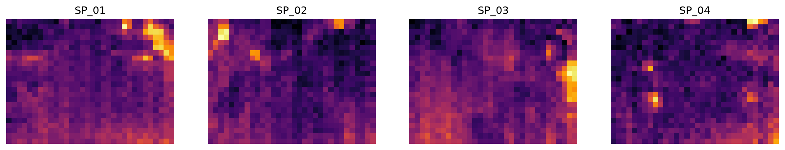

# Clean


<!-- WARNING: THIS FILE WAS AUTOGENERATED! DO NOT EDIT! -->

Each sensor node (`SP_01`, `SP_02`, …) writes a CSV log to its SD card.
A row is one thermal frame: 768 pixel temperatures from the 32 × 24
MLX90640 camera, plus the soil readings and, on `SP_01` only, the Ruuvi
air sensor. Logs from different nodes differ in format and carry sensor
faults, and future batches will too.

This module turns any set of logs into one DataFrame with a fixed
schema, one row per frame, sorted by node and time. Faulty values are
set to missing and flagged, never dropped: the raw logs stay the
reference, and each analysis decides what to exclude.

``` python
import matplotlib.pyplot as plt
from fastcore.test import *
```

## Reading one log

A log’s columns fall into five groups. The schema below fixes their
names and order for every node:

The logger writes the date and time as text next to the Unix timestamp,
and the Ruuvi columns only when the firmware expects that sensor. So a
raw line has one of two layouts, told apart by their field count:

------------------------------------------------------------------------

### read_log

``` python
def read_log(
    path, # CSV log written by one node
)->pandas.DataFrame: # One row per frame, columns in `schema` order, sorted by time and frame
```

*Read one node’s log into the common schema*

A log is not one table. The logger appends lines, and a single file can
mix formats: `SP_02` switches from `;` to `,` delimiters across an
outage in late September, and its first ten lines after the switch use
`SP_01`’s Ruuvi layout. So `read_log` splits each line on its own
delimiter and picks the column layout from its field count. A field
count matching no known layout raises an error: a new firmware format
should be noticed, not guessed.

Beyond that, `read_log` strips the leading space from `node_id`, adds
the Ruuvi columns as missing for nodes without that sensor, and turns
the `-999` the logger writes for “no reading” into missing values.

`time` comes from the Unix `timestamp`, which encodes Austrian local
time (it converts to the same wall-clock time the logger writes in its
`date` and `time` columns). Those two text columns are dropped: they
repeat `timestamp`, in a format that varies even within one file
(`2026-09-23` versus `23/09/2026`).

``` python
data = Path('../data/b01')
sp2 = read_log(data/'dados_SP_02.csv')
sp2.iloc[:3, :12]
```

<div>
<style scoped>
    .dataframe tbody tr th:only-of-type {
        vertical-align: middle;
    }
&#10;    .dataframe tbody tr th {
        vertical-align: top;
    }
&#10;    .dataframe thead th {
        text-align: right;
    }
</style>

<table class="dataframe" data-quarto-postprocess="true" data-border="1">
<thead>
<tr style="text-align: right;">
<th data-quarto-table-cell-role="th"></th>
<th data-quarto-table-cell-role="th">node_id</th>
<th data-quarto-table-cell-role="th">time</th>
<th data-quarto-table-cell-role="th">timestamp</th>
<th data-quarto-table-cell-role="th">measurement_id</th>
<th data-quarto-table-cell-role="th">frame</th>
<th data-quarto-table-cell-role="th">ruuvi_temp</th>
<th data-quarto-table-cell-role="th">ruuvi_humidity</th>
<th data-quarto-table-cell-role="th">ruuvi_pressure</th>
<th data-quarto-table-cell-role="th">soil_moisture</th>
<th data-quarto-table-cell-role="th">soil_temperature</th>
<th data-quarto-table-cell-role="th">leaf_temp_mean</th>
<th data-quarto-table-cell-role="th">leaf_temp_max</th>
</tr>
</thead>
<tbody>
<tr>
<td data-quarto-table-cell-role="th">0</td>
<td>SP_02</td>
<td>2026-09-23 11:49:21</td>
<td>1790164161</td>
<td>5967213</td>
<td>1</td>
<td>NaN</td>
<td>NaN</td>
<td>NaN</td>
<td>24.5</td>
<td>22.5</td>
<td>26.02</td>
<td>31.39</td>
</tr>
<tr>
<td data-quarto-table-cell-role="th">1</td>
<td>SP_02</td>
<td>2026-09-23 11:49:21</td>
<td>1790164161</td>
<td>5967213</td>
<td>2</td>
<td>NaN</td>
<td>NaN</td>
<td>NaN</td>
<td>24.5</td>
<td>22.5</td>
<td>25.98</td>
<td>31.73</td>
</tr>
<tr>
<td data-quarto-table-cell-role="th">2</td>
<td>SP_02</td>
<td>2026-09-23 11:49:21</td>
<td>1790164161</td>
<td>5967213</td>
<td>3</td>
<td>NaN</td>
<td>NaN</td>
<td>NaN</td>
<td>24.5</td>
<td>22.5</td>
<td>26.09</td>
<td>31.12</td>
</tr>
</tbody>
</table>

</div>

## All logs in one table

------------------------------------------------------------------------

### read_logs

``` python
def read_logs(
    paths, # CSV logs, one or more per node
)->pandas.DataFrame: # One row per frame for all nodes, sorted by node, time and frame
```

*Read logs from all nodes into one table*

A node may leave several logs, for instance one per SD-card import, so
`read_logs` takes any list of paths:

``` python
df = read_logs(sorted(data.glob('dados_*.csv')))
df.groupby('node_id').time.agg(['count', 'min', 'max'])
```

<div>
<style scoped>
    .dataframe tbody tr th:only-of-type {
        vertical-align: middle;
    }
&#10;    .dataframe tbody tr th {
        vertical-align: top;
    }
&#10;    .dataframe thead th {
        text-align: right;
    }
</style>

<table class="dataframe" data-quarto-postprocess="true" data-border="1">
<thead>
<tr style="text-align: right;">
<th data-quarto-table-cell-role="th"></th>
<th data-quarto-table-cell-role="th">count</th>
<th data-quarto-table-cell-role="th">min</th>
<th data-quarto-table-cell-role="th">max</th>
</tr>
<tr>
<th data-quarto-table-cell-role="th">node_id</th>
<th data-quarto-table-cell-role="th"></th>
<th data-quarto-table-cell-role="th"></th>
<th data-quarto-table-cell-role="th"></th>
</tr>
</thead>
<tbody>
<tr>
<td data-quarto-table-cell-role="th">SP_01</td>
<td>9159</td>
<td>2026-09-23 11:58:45</td>
<td>2026-10-05 16:45:00</td>
</tr>
<tr>
<td data-quarto-table-cell-role="th">SP_02</td>
<td>12185</td>
<td>2026-09-23 11:49:21</td>
<td>2026-10-05 16:50:00</td>
</tr>
<tr>
<td data-quarto-table-cell-role="th">SP_03</td>
<td>9991</td>
<td>2026-09-23 11:42:19</td>
<td>2026-10-05 16:50:00</td>
</tr>
<tr>
<td data-quarto-table-cell-role="th">SP_04</td>
<td>14170</td>
<td>2026-09-23 11:37:37</td>
<td>2026-10-05 16:45:00</td>
</tr>
</tbody>
</table>

</div>

## Quality flags

Sensors sometimes return values no plant or soil can have: a pixel at
877 °C or −253 °C after a faulty camera read, or a soil moisture of
exactly 0 when the probe drops out. `limits` holds the open interval of
plausible values for each measurement:

------------------------------------------------------------------------

### clean

``` python
def clean(
    df:pandas.DataFrame, # Output of `read_logs`
    limits:dict={'pixel': (0, 60), 'soil_moisture': (0, 100), 'soil_temperature': (0, 60)}, # Open interval of plausible values per measurement
)->pandas.DataFrame: # Same rows, implausible values missing, with `qc_*` flag columns
```

*Set implausible values to missing, flag them, and recompute leaf
summaries from the remaining pixels*

`clean` keeps every row. A value outside its limits becomes missing, and
a flag column records that it was there: `qc_bad_px` counts the pixels
removed from each frame, and `qc_soil` marks rows that lost a soil
reading. Values the logger never had (its `-999`) are simply missing,
without a flag. The leaf summaries are recomputed from the remaining
pixels, since the logger’s own summaries include the faulty ones: a
single 877 °C pixel would otherwise set `leaf_temp_max`.

``` python
cdf = clean(df)
cdf.groupby('node_id')[['qc_bad_px', 'qc_soil']].agg(lambda s: (s > 0).sum())
```

<div>
<style scoped>
    .dataframe tbody tr th:only-of-type {
        vertical-align: middle;
    }
&#10;    .dataframe tbody tr th {
        vertical-align: top;
    }
&#10;    .dataframe thead th {
        text-align: right;
    }
</style>

<table class="dataframe" data-quarto-postprocess="true" data-border="1">
<thead>
<tr style="text-align: right;">
<th data-quarto-table-cell-role="th"></th>
<th data-quarto-table-cell-role="th">qc_bad_px</th>
<th data-quarto-table-cell-role="th">qc_soil</th>
</tr>
<tr>
<th data-quarto-table-cell-role="th">node_id</th>
<th data-quarto-table-cell-role="th"></th>
<th data-quarto-table-cell-role="th"></th>
</tr>
</thead>
<tbody>
<tr>
<td data-quarto-table-cell-role="th">SP_01</td>
<td>22</td>
<td>5</td>
</tr>
<tr>
<td data-quarto-table-cell-role="th">SP_02</td>
<td>150</td>
<td>0</td>
</tr>
<tr>
<td data-quarto-table-cell-role="th">SP_03</td>
<td>212</td>
<td>0</td>
</tr>
<tr>
<td data-quarto-table-cell-role="th">SP_04</td>
<td>109</td>
<td>0</td>
</tr>
</tbody>
</table>

</div>

The raw maximum leaf temperature reaches several hundred degrees; after
cleaning, it stays within the limits:

``` python
test_eq(cdf.leaf_temp_max.max() < limits['pixel'][1], True)
df.leaf_temp_max.max(), cdf.leaf_temp_max.max()
```

    (np.float64(877.1), np.float64(59.99))

## One row per measurement

Every 5 minutes, a node takes a burst of usually 5 frames within one
second. All frames in a burst share `measurement_id` and `time`. The
firmware reads the soil and Ruuvi sensors once per burst, so each
frame’s row repeats the same values. The pixels differ by about 0.3 °C
from frame to frame, which looks like camera noise.

`measurements` combines each burst into one row. Each pixel becomes its
median across the burst’s frames, so one faulty frame doesn’t move the
result. Run it after `clean`, so pixels outside the limits are already
missing and don’t count.

------------------------------------------------------------------------

### measurements

``` python
def measurements(
    df:pandas.DataFrame, # Output of `clean`
)->pandas.DataFrame: # One row per node and time, with the median image of the burst
```

*Combine each burst of frames into one measurement*

`n_frames` counts the frames in the burst. The leaf summaries are
recomputed from the median image. `qc_bad_px` is the number of pixel
readings removed from the whole burst, and `qc_soil` is true if any
frame lost a soil reading. In batch 1, each frame with no valid pixel
sits in a burst with good frames, so every measurement has an image:

``` python
mdf = measurements(cdf)
test_eq(mdf[px_cols].isna().all(axis=1).sum(), 0)
mdf.groupby('node_id').n_frames.value_counts().unstack(fill_value=0)
```

<div>
<style scoped>
    .dataframe tbody tr th:only-of-type {
        vertical-align: middle;
    }
&#10;    .dataframe tbody tr th {
        vertical-align: top;
    }
&#10;    .dataframe thead th {
        text-align: right;
    }
</style>

<table class="dataframe" data-quarto-postprocess="true" data-border="1">
<thead>
<tr style="text-align: right;">
<th data-quarto-table-cell-role="th">n_frames</th>
<th data-quarto-table-cell-role="th">2</th>
<th data-quarto-table-cell-role="th">4</th>
<th data-quarto-table-cell-role="th">5</th>
</tr>
<tr>
<th data-quarto-table-cell-role="th">node_id</th>
<th data-quarto-table-cell-role="th"></th>
<th data-quarto-table-cell-role="th"></th>
<th data-quarto-table-cell-role="th"></th>
</tr>
</thead>
<tbody>
<tr>
<td data-quarto-table-cell-role="th">SP_01</td>
<td>0</td>
<td>1</td>
<td>1831</td>
</tr>
<tr>
<td data-quarto-table-cell-role="th">SP_02</td>
<td>0</td>
<td>0</td>
<td>2437</td>
</tr>
<tr>
<td data-quarto-table-cell-role="th">SP_03</td>
<td>1</td>
<td>1</td>
<td>1997</td>
</tr>
<tr>
<td data-quarto-table-cell-role="th">SP_04</td>
<td>0</td>
<td>0</td>
<td>2834</td>
</tr>
</tbody>
</table>

</div>

## Air readings for every node

The nodes share one greenhouse, and the single Ruuvi sensor is wired to
`SP_01`. Its air temperature, humidity and pressure therefore apply to
every plant, and leaf minus air temperature is a key input to the crop
water stress index. `share_ruuvi` copies the `source` node’s Ruuvi
readings to every node. It matches each row to the nearest valid reading
in time, within `tolerance`. The node clocks agree to about a second, so
half of the 5-minute step is a safe tolerance. A row with no reading
within `tolerance`, for instance during an outage of `SP_01`, gets
missing values.

------------------------------------------------------------------------

### share_ruuvi

``` python
def share_ruuvi(
    df:pandas.DataFrame, # Output of `clean` or `measurements`
    source:str='SP_01', # Node with the Ruuvi sensor
    tolerance:str='150s', # Largest time difference to the matched reading
)->pandas.DataFrame: # Same rows, with the source node's Ruuvi readings on every node
```

*Copy the Ruuvi readings of `source` to every node, matched by time*

Share of measurements with an air temperature, per node. Outside the
outages of `SP_01`, every node has one:

``` python
mdf = share_ruuvi(mdf)
mdf.groupby('node_id').ruuvi_temp.apply(lambda s: s.notna().mean()).round(2)
```

    node_id
    SP_01    0.85
    SP_02    0.58
    SP_03    0.71
    SP_04    0.51
    Name: ruuvi_temp, dtype: float64

## Thermal images

------------------------------------------------------------------------

### frames

``` python
def frames(
    df:pandas.DataFrame, # Rows of `read_logs`, `clean` or `measurements` output
)->numpy.ndarray: # Shape `(len(df), 24, 32)`, one thermal image per row
```

*Thermal images of the frames in `df`*

Each row’s 768 pixels are one 24 × 32 image, stored row by row. `frames`
reshapes them, so any selection of rows, by node, time or flag, gives an
image stack. Here is the first frame of each node:

``` python
first = cdf.groupby('node_id').head(1)
fig, axs = plt.subplots(1, len(first), figsize=(16, 3))
for ax, im, node in zip(axs, frames(first), first.node_id):
    ax.imshow(im, cmap='inferno')
    ax.set_title(node)
    ax.axis('off')
```



## Quality report

------------------------------------------------------------------------

### qc_report

``` python
def qc_report(
    df:pandas.DataFrame, # Output of `clean`
    max_step:str='15min', # Longest expected interval between measurements
)->pandas.DataFrame: # One row per node
```

*Per-node summary of coverage, gaps and quality flags*

`qc_report` summarises a batch per node: its time span, the number of
gaps longer than `max_step`, the share of rows with each environmental
reading, and the frames and rows affected by the quality flags.
`frames_no_px` counts frames with no valid pixel left, either because
the camera returned nothing or because every pixel was implausible.

``` python
rep = qc_report(cdf)
rep.T
```

<div>
<style scoped>
    .dataframe tbody tr th:only-of-type {
        vertical-align: middle;
    }
&#10;    .dataframe tbody tr th {
        vertical-align: top;
    }
&#10;    .dataframe thead th {
        text-align: right;
    }
</style>

<table class="dataframe" data-quarto-postprocess="true" data-border="1">
<thead>
<tr style="text-align: right;">
<th data-quarto-table-cell-role="th">node_id</th>
<th data-quarto-table-cell-role="th">SP_01</th>
<th data-quarto-table-cell-role="th">SP_02</th>
<th data-quarto-table-cell-role="th">SP_03</th>
<th data-quarto-table-cell-role="th">SP_04</th>
</tr>
</thead>
<tbody>
<tr>
<td data-quarto-table-cell-role="th">frames</td>
<td>9159</td>
<td>12185</td>
<td>9991</td>
<td>14170</td>
</tr>
<tr>
<td data-quarto-table-cell-role="th">measurements</td>
<td>1832</td>
<td>2437</td>
<td>1999</td>
<td>2834</td>
</tr>
<tr>
<td data-quarto-table-cell-role="th">first</td>
<td>2026-09-23 11:58:45</td>
<td>2026-09-23 11:49:21</td>
<td>2026-09-23 11:42:19</td>
<td>2026-09-23 11:37:37</td>
</tr>
<tr>
<td data-quarto-table-cell-role="th">last</td>
<td>2026-10-05 16:45:00</td>
<td>2026-10-05 16:50:00</td>
<td>2026-10-05 16:50:00</td>
<td>2026-10-05 16:45:00</td>
</tr>
<tr>
<td data-quarto-table-cell-role="th">gaps</td>
<td>6</td>
<td>4</td>
<td>7</td>
<td>5</td>
</tr>
<tr>
<td data-quarto-table-cell-role="th">longest_gap</td>
<td>2 days 08:36:05</td>
<td>2 days 22:09:08</td>
<td>2 days 07:15:16</td>
<td>1 days 07:41:09</td>
</tr>
<tr>
<td data-quarto-table-cell-role="th">ruuvi_temp_%</td>
<td>85.2</td>
<td>0.0</td>
<td>0.0</td>
<td>0.0</td>
</tr>
<tr>
<td data-quarto-table-cell-role="th">soil_moisture_%</td>
<td>99.9</td>
<td>21.7</td>
<td>15.3</td>
<td>100.0</td>
</tr>
<tr>
<td data-quarto-table-cell-role="th">soil_temperature_%</td>
<td>100.0</td>
<td>14.2</td>
<td>15.3</td>
<td>100.0</td>
</tr>
<tr>
<td data-quarto-table-cell-role="th">frames_bad_px</td>
<td>22</td>
<td>150</td>
<td>212</td>
<td>109</td>
</tr>
<tr>
<td data-quarto-table-cell-role="th">frames_no_px</td>
<td>1</td>
<td>3</td>
<td>2</td>
<td>1</td>
</tr>
<tr>
<td data-quarto-table-cell-role="th">soil_flagged</td>
<td>5</td>
<td>0</td>
<td>0</td>
<td>0</td>
</tr>
</tbody>
</table>

</div>

------------------------------------------------------------------------

### find_gaps

``` python
def find_gaps(
    df:pandas.DataFrame, # Output of `read_logs` or `clean`
    max_step:str='15min', # Longest expected interval between measurements
)->pandas.DataFrame: # One row per gap: node, last measurement before it, first after it, and duration
```

*Intervals longer than `max_step` without a measurement, per node*

`find_gaps` lists the outages behind the `gaps` count, to line them up
across nodes:

``` python
gaps = find_gaps(cdf)
gaps
```

<div>
<style scoped>
    .dataframe tbody tr th:only-of-type {
        vertical-align: middle;
    }
&#10;    .dataframe tbody tr th {
        vertical-align: top;
    }
&#10;    .dataframe thead th {
        text-align: right;
    }
</style>

<table class="dataframe" data-quarto-postprocess="true" data-border="1">
<thead>
<tr style="text-align: right;">
<th data-quarto-table-cell-role="th"></th>
<th data-quarto-table-cell-role="th">node_id</th>
<th data-quarto-table-cell-role="th">start</th>
<th data-quarto-table-cell-role="th">end</th>
<th data-quarto-table-cell-role="th">duration</th>
</tr>
</thead>
<tbody>
<tr>
<td data-quarto-table-cell-role="th">0</td>
<td>SP_01</td>
<td>2026-09-23 18:05:00</td>
<td>2026-09-24 10:16:55</td>
<td>0 days 16:11:55</td>
</tr>
<tr>
<td data-quarto-table-cell-role="th">1</td>
<td>SP_01</td>
<td>2026-09-24 10:30:00</td>
<td>2026-09-24 14:19:12</td>
<td>0 days 03:49:12</td>
</tr>
<tr>
<td data-quarto-table-cell-role="th">2</td>
<td>SP_01</td>
<td>2026-09-24 14:19:12</td>
<td>2026-09-24 14:40:37</td>
<td>0 days 00:21:25</td>
</tr>
<tr>
<td data-quarto-table-cell-role="th">3</td>
<td>SP_01</td>
<td>2026-09-26 03:35:00</td>
<td>2026-09-28 09:14:11</td>
<td>2 days 05:39:11</td>
</tr>
<tr>
<td data-quarto-table-cell-role="th">4</td>
<td>SP_01</td>
<td>2026-09-30 03:50:00</td>
<td>2026-09-30 13:45:02</td>
<td>0 days 09:55:02</td>
</tr>
<tr>
<td data-quarto-table-cell-role="th">5</td>
<td>SP_01</td>
<td>2026-10-02 23:45:01</td>
<td>2026-10-05 08:21:06</td>
<td>2 days 08:36:05</td>
</tr>
<tr>
<td data-quarto-table-cell-role="th">6</td>
<td>SP_02</td>
<td>2026-09-24 00:05:01</td>
<td>2026-09-24 10:19:29</td>
<td>0 days 10:14:28</td>
</tr>
<tr>
<td data-quarto-table-cell-role="th">7</td>
<td>SP_02</td>
<td>2026-09-25 17:30:00</td>
<td>2026-09-28 15:39:08</td>
<td>2 days 22:09:08</td>
</tr>
<tr>
<td data-quarto-table-cell-role="th">8</td>
<td>SP_02</td>
<td>2026-09-30 05:35:01</td>
<td>2026-09-30 13:44:19</td>
<td>0 days 08:09:18</td>
</tr>
<tr>
<td data-quarto-table-cell-role="th">9</td>
<td>SP_02</td>
<td>2026-10-01 12:00:01</td>
<td>2026-10-01 14:07:37</td>
<td>0 days 02:07:36</td>
</tr>
<tr>
<td data-quarto-table-cell-role="th">10</td>
<td>SP_03</td>
<td>2026-09-24 05:45:01</td>
<td>2026-09-24 10:13:53</td>
<td>0 days 04:28:52</td>
</tr>
<tr>
<td data-quarto-table-cell-role="th">11</td>
<td>SP_03</td>
<td>2026-09-24 11:00:00</td>
<td>2026-09-24 14:37:49</td>
<td>0 days 03:37:49</td>
</tr>
<tr>
<td data-quarto-table-cell-role="th">12</td>
<td>SP_03</td>
<td>2026-09-24 23:35:00</td>
<td>2026-09-25 08:39:07</td>
<td>0 days 09:04:07</td>
</tr>
<tr>
<td data-quarto-table-cell-role="th">13</td>
<td>SP_03</td>
<td>2026-09-25 09:30:00</td>
<td>2026-09-25 13:15:41</td>
<td>0 days 03:45:41</td>
</tr>
<tr>
<td data-quarto-table-cell-role="th">14</td>
<td>SP_03</td>
<td>2026-09-26 18:35:00</td>
<td>2026-09-28 15:27:49</td>
<td>1 days 20:52:49</td>
</tr>
<tr>
<td data-quarto-table-cell-role="th">15</td>
<td>SP_03</td>
<td>2026-09-30 07:15:01</td>
<td>2026-09-30 13:41:41</td>
<td>0 days 06:26:40</td>
</tr>
<tr>
<td data-quarto-table-cell-role="th">16</td>
<td>SP_03</td>
<td>2026-10-03 01:05:01</td>
<td>2026-10-05 08:20:17</td>
<td>2 days 07:15:16</td>
</tr>
<tr>
<td data-quarto-table-cell-role="th">17</td>
<td>SP_04</td>
<td>2026-09-23 16:20:00</td>
<td>2026-09-24 10:08:16</td>
<td>0 days 17:48:16</td>
</tr>
<tr>
<td data-quarto-table-cell-role="th">18</td>
<td>SP_04</td>
<td>2026-09-24 11:40:00</td>
<td>2026-09-24 13:17:08</td>
<td>0 days 01:37:08</td>
</tr>
<tr>
<td data-quarto-table-cell-role="th">19</td>
<td>SP_04</td>
<td>2026-09-25 05:55:00</td>
<td>2026-09-25 08:29:13</td>
<td>0 days 02:34:13</td>
</tr>
<tr>
<td data-quarto-table-cell-role="th">20</td>
<td>SP_04</td>
<td>2026-09-27 07:25:00</td>
<td>2026-09-28 15:06:09</td>
<td>1 days 07:41:09</td>
</tr>
<tr>
<td data-quarto-table-cell-role="th">21</td>
<td>SP_04</td>
<td>2026-09-30 10:00:00</td>
<td>2026-09-30 13:41:17</td>
<td>0 days 03:41:17</td>
</tr>
</tbody>
</table>

</div>
