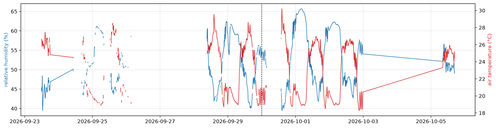
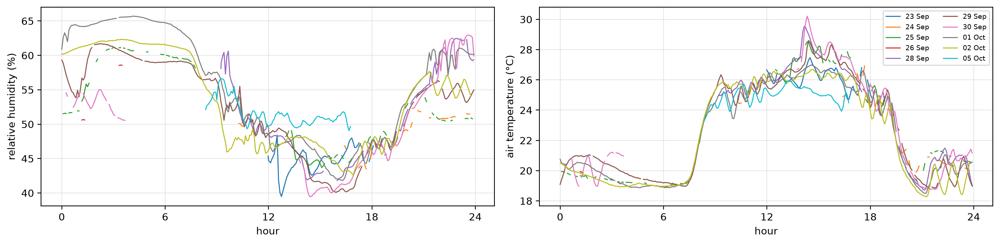
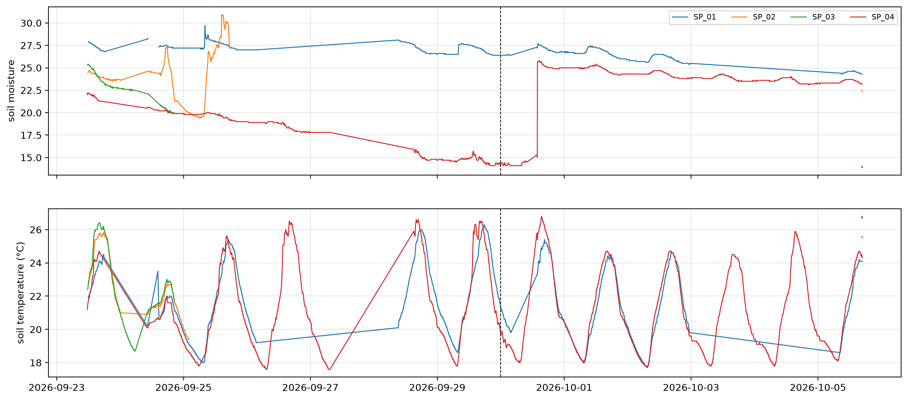

# Environment


<!-- WARNING: THIS FILE WAS AUTOGENERATED! DO NOT EDIT! -->

The Ruuvi sensor on `SP_01` logs air temperature and relative humidity
for the whole greenhouse. Each node logs the moisture and temperature of
its own pot. This notebook plots both over the batch from 23 September
to 5 October 2026.

``` python
import pandas as pd, matplotlib.pyplot as plt
from fastcore.utils import *
from speaking_plants.clean import *
from speaking_plants.leaf import *
```

``` python
data = Path('../data/b01')
mdf = share_ruuvi(measurements(clean(read_logs(sorted(data.glob('dados_*.csv'))))))
air = mdf[mdf.node_id == 'SP_01'].set_index('time')
```

## Air humidity

Relative humidity and air temperature from the Ruuvi sensor. Gaps are
outages of `SP_01` or missing Ruuvi readings. The dashed line marks 30
September, when the scenes of all four cameras changed:

``` python
fig, ax = plt.subplots(figsize=(16, 4))
ax.plot(air.index, air.ruuvi_humidity, lw=1, c='C0')
ax.set_ylabel('relative humidity (%)', color='C0')
ax2 = ax.twinx()
ax2.plot(air.index, air.ruuvi_temp, lw=1, c='C3')
ax2.set_ylabel('air temperature (°C)', color='C3')
ax.axvline(pd.Timestamp('2026-09-30'), c='k', ls='--', lw=0.8); ax.grid(alpha=0.3)
```



By time of day, one line per day:

``` python
a = air.reset_index().assign(day=lambda d: d.time.dt.normalize(), hour=lambda d: (d.time - d.time.dt.normalize()).dt.total_seconds() / 3600)
fig, axs = plt.subplots(1, 2, figsize=(14, 3.5))
for ax, col, lab in zip(axs, ['ruuvi_humidity', 'ruuvi_temp'], ['relative humidity (%)', 'air temperature (°C)']):
    for d, g in a.groupby('day'): ax.plot(g.hour, g[col], lw=1, label=f'{d:%d %b}')
    ax.set_xticks(range(0, 25, 6)); ax.set_xlabel('hour'); ax.set_ylabel(lab); ax.grid(alpha=0.3)
axs[1].legend(fontsize=7, ncol=2)
plt.tight_layout()
```



## Soil moisture

Soil moisture and soil temperature of each node. The soil sensors of
`SP_02` and `SP_03` failed for most of the batch, so their lines are
short:

``` python
fig, axs = plt.subplots(2, 1, figsize=(16, 7), sharex=True)
for node, g in mdf.groupby('node_id'):
    axs[0].plot(g.time, g.soil_moisture, lw=1, label=node)
    axs[1].plot(g.time, g.soil_temperature, lw=1, label=node)
axs[0].set_ylabel('soil moisture'); axs[1].set_ylabel('soil temperature (°C)')
for ax in axs: ax.axvline(pd.Timestamp('2026-09-30'), c='k', ls='--', lw=0.8); ax.grid(alpha=0.3)
axs[0].legend(fontsize=8, ncol=4)
```



The daily median shows the trends without the daily cycle:

``` python
mdf.groupby([mdf.time.dt.normalize().rename('day'), 'node_id']).soil_moisture.median().unstack().round(1)
```

<div>
<style scoped>
    .dataframe tbody tr th:only-of-type {
        vertical-align: middle;
    }
&#10;    .dataframe tbody tr th {
        vertical-align: top;
    }
&#10;    .dataframe thead th {
        text-align: right;
    }
</style>

<table class="dataframe" data-quarto-postprocess="true" data-border="1">
<thead>
<tr style="text-align: right;">
<th data-quarto-table-cell-role="th">node_id</th>
<th data-quarto-table-cell-role="th">SP_01</th>
<th data-quarto-table-cell-role="th">SP_02</th>
<th data-quarto-table-cell-role="th">SP_03</th>
<th data-quarto-table-cell-role="th">SP_04</th>
</tr>
<tr>
<th data-quarto-table-cell-role="th">day</th>
<th data-quarto-table-cell-role="th"></th>
<th data-quarto-table-cell-role="th"></th>
<th data-quarto-table-cell-role="th"></th>
<th data-quarto-table-cell-role="th"></th>
</tr>
</thead>
<tbody>
<tr>
<td data-quarto-table-cell-role="th">2026-09-23</td>
<td>27.3</td>
<td>23.9</td>
<td>23.4</td>
<td>21.9</td>
</tr>
<tr>
<td data-quarto-table-cell-role="th">2026-09-24</td>
<td>27.3</td>
<td>24.4</td>
<td>22.1</td>
<td>20.2</td>
</tr>
<tr>
<td data-quarto-table-cell-role="th">2026-09-25</td>
<td>27.2</td>
<td>24.1</td>
<td>NaN</td>
<td>19.8</td>
</tr>
<tr>
<td data-quarto-table-cell-role="th">2026-09-26</td>
<td>27.0</td>
<td>NaN</td>
<td>NaN</td>
<td>18.8</td>
</tr>
<tr>
<td data-quarto-table-cell-role="th">2026-09-27</td>
<td>NaN</td>
<td>NaN</td>
<td>NaN</td>
<td>17.8</td>
</tr>
<tr>
<td data-quarto-table-cell-role="th">2026-09-28</td>
<td>27.2</td>
<td>NaN</td>
<td>NaN</td>
<td>14.8</td>
</tr>
<tr>
<td data-quarto-table-cell-role="th">2026-09-29</td>
<td>26.6</td>
<td>NaN</td>
<td>NaN</td>
<td>14.7</td>
</tr>
<tr>
<td data-quarto-table-cell-role="th">2026-09-30</td>
<td>26.8</td>
<td>NaN</td>
<td>NaN</td>
<td>20.1</td>
</tr>
<tr>
<td data-quarto-table-cell-role="th">2026-10-01</td>
<td>26.7</td>
<td>NaN</td>
<td>NaN</td>
<td>25.0</td>
</tr>
<tr>
<td data-quarto-table-cell-role="th">2026-10-02</td>
<td>25.8</td>
<td>NaN</td>
<td>NaN</td>
<td>24.3</td>
</tr>
<tr>
<td data-quarto-table-cell-role="th">2026-10-03</td>
<td>NaN</td>
<td>NaN</td>
<td>NaN</td>
<td>23.8</td>
</tr>
<tr>
<td data-quarto-table-cell-role="th">2026-10-04</td>
<td>NaN</td>
<td>NaN</td>
<td>NaN</td>
<td>23.6</td>
</tr>
<tr>
<td data-quarto-table-cell-role="th">2026-10-05</td>
<td>24.5</td>
<td>22.5</td>
<td>14.0</td>
<td>23.3</td>
</tr>
</tbody>
</table>

</div>

The soil of `SP_04` dried from 21.9 on 23 September to 14.7 on 29
September. Its moisture rose from 15.3 to 25.8 between 13:41 and 14:35
on 30 September, which looks like watering. `SP_01` dried slowly, from
27.3 to 24.5, and shows no watering.

## Soil drying and leaf temperature on SP_04

If the plant on `SP_04` was short of water on 29 September, it would
transpire less and its leaves would warm above air temperature at
midday. The table gives, per day, the mean unmasked leaf minus air
temperature from 11:00 to 14:00, with the number of 5-minute values that
have an air reading, next to the median soil moisture:

``` python
us = leaf_series(mdf, no_masks(full_days(mdf, min_n=13)))
s4 = us[(us.node_id == 'SP_04') & (us.hour >= 11) & (us.hour < 14)]
mid = s4.groupby('day').agg(dt_leaf_air=('dt_leaf_air', 'mean'), n_air=('dt_leaf_air', 'count'))
soil = mdf[mdf.node_id == 'SP_04'].groupby(mdf.time.dt.normalize().rename('day')).soil_moisture.median()
mid.join(soil).round(2)
```

<div>
<style scoped>
    .dataframe tbody tr th:only-of-type {
        vertical-align: middle;
    }
&#10;    .dataframe tbody tr th {
        vertical-align: top;
    }
&#10;    .dataframe thead th {
        text-align: right;
    }
</style>

<table class="dataframe" data-quarto-postprocess="true" data-border="1">
<thead>
<tr style="text-align: right;">
<th data-quarto-table-cell-role="th"></th>
<th data-quarto-table-cell-role="th">dt_leaf_air</th>
<th data-quarto-table-cell-role="th">n_air</th>
<th data-quarto-table-cell-role="th">soil_moisture</th>
</tr>
<tr>
<th data-quarto-table-cell-role="th">day</th>
<th data-quarto-table-cell-role="th"></th>
<th data-quarto-table-cell-role="th"></th>
<th data-quarto-table-cell-role="th"></th>
</tr>
</thead>
<tbody>
<tr>
<td data-quarto-table-cell-role="th">2026-09-23</td>
<td>-0.78</td>
<td>24</td>
<td>21.90</td>
</tr>
<tr>
<td data-quarto-table-cell-role="th">2026-09-24</td>
<td>NaN</td>
<td>0</td>
<td>20.20</td>
</tr>
<tr>
<td data-quarto-table-cell-role="th">2026-09-25</td>
<td>-1.32</td>
<td>16</td>
<td>19.75</td>
</tr>
<tr>
<td data-quarto-table-cell-role="th">2026-09-26</td>
<td>NaN</td>
<td>0</td>
<td>18.80</td>
</tr>
<tr>
<td data-quarto-table-cell-role="th">2026-09-29</td>
<td>0.75</td>
<td>36</td>
<td>14.70</td>
</tr>
<tr>
<td data-quarto-table-cell-role="th">2026-09-30</td>
<td>3.27</td>
<td>1</td>
<td>20.10</td>
</tr>
<tr>
<td data-quarto-table-cell-role="th">2026-10-01</td>
<td>-1.20</td>
<td>36</td>
<td>25.00</td>
</tr>
<tr>
<td data-quarto-table-cell-role="th">2026-10-02</td>
<td>-1.33</td>
<td>36</td>
<td>24.30</td>
</tr>
<tr>
<td data-quarto-table-cell-role="th">2026-10-03</td>
<td>NaN</td>
<td>0</td>
<td>23.80</td>
</tr>
<tr>
<td data-quarto-table-cell-role="th">2026-10-04</td>
<td>NaN</td>
<td>0</td>
<td>23.60</td>
</tr>
<tr>
<td data-quarto-table-cell-role="th">2026-10-05</td>
<td>-0.26</td>
<td>36</td>
<td>23.30</td>
</tr>
</tbody>
</table>

</div>

The midday difference is negative while the soil is moist and positive
on 29 September, the driest day with air readings. The camera scene of
`SP_04` changed on 30 September as well, and only three days before the
watering have midday air readings: 23, 25 and 29 September. This is a
lead to test on the next batch, not a result.
