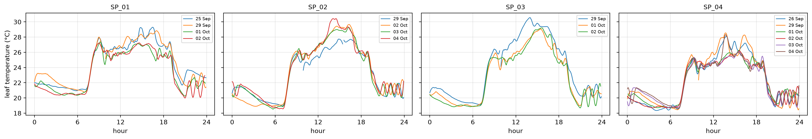
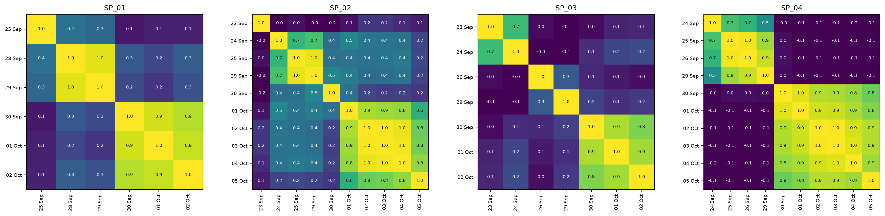
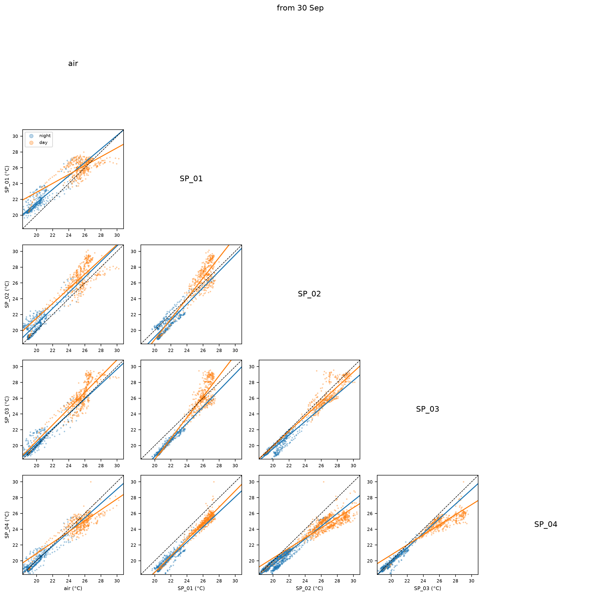

# Leaf temperature


<!-- WARNING: THIS FILE WAS AUTOGENERATED! DO NOT EDIT! -->

This module turns the measurements of `clean` into one leaf temperature
series per node and day. Each thermal image also shows background, so a
mask keeps only the leaf pixels: the pixels that vary most over time,
since a leaf warms and cools more than its surroundings. From the masked
pixels, each image gives one leaf temperature. Its rate of change, from
a Savitzky-Golay filter, and its difference to air temperature are the
signatures to compare across days and nodes.

``` python
from fastcore.utils import *
from fastcore.test import *
from speaking_plants.clean import *
```

## Data

The input is one row per measurement, from `measurements`, with the
Ruuvi readings of `SP_01` shared with every node by `share_ruuvi`. The
examples use batch 1, from `data/b01/`:

``` python
data = Path('../data/b01')
mdf = share_ruuvi(measurements(clean(read_logs(sorted(data.glob('dados_*.csv'))))))
```

## Full days

A day of measurements every 5 minutes has 288 of them. Only days close
to that show the whole daily cycle, so the analysis keeps node-days with
at least `min_n` measurements. Days run from midnight to midnight, local
time.

------------------------------------------------------------------------

### full_days

``` python
def full_days(
    df:pandas.DataFrame, # Output of `measurements`
    min_n:int=280, # Fewest measurements for a full day
)->pandas.DataFrame: # One row per full day, with `node_id` and `day`
```

*Node-days with at least `min_n` measurements*

``` python
days = full_days(mdf)
days.assign(v='✓').pivot(index='day', columns='node_id', values='v').fillna('')
```

<div>
<style scoped>
    .dataframe tbody tr th:only-of-type {
        vertical-align: middle;
    }
&#10;    .dataframe tbody tr th {
        vertical-align: top;
    }
&#10;    .dataframe thead th {
        text-align: right;
    }
</style>

<table class="dataframe" data-quarto-postprocess="true" data-border="1">
<thead>
<tr style="text-align: right;">
<th data-quarto-table-cell-role="th">node_id</th>
<th data-quarto-table-cell-role="th">SP_01</th>
<th data-quarto-table-cell-role="th">SP_02</th>
<th data-quarto-table-cell-role="th">SP_03</th>
<th data-quarto-table-cell-role="th">SP_04</th>
</tr>
<tr>
<th data-quarto-table-cell-role="th">day</th>
<th data-quarto-table-cell-role="th"></th>
<th data-quarto-table-cell-role="th"></th>
<th data-quarto-table-cell-role="th"></th>
<th data-quarto-table-cell-role="th"></th>
</tr>
</thead>
<tbody>
<tr>
<td data-quarto-table-cell-role="th">2026-09-25</td>
<td>✓</td>
<td></td>
<td></td>
<td></td>
</tr>
<tr>
<td data-quarto-table-cell-role="th">2026-09-26</td>
<td></td>
<td></td>
<td></td>
<td>✓</td>
</tr>
<tr>
<td data-quarto-table-cell-role="th">2026-09-29</td>
<td>✓</td>
<td>✓</td>
<td>✓</td>
<td>✓</td>
</tr>
<tr>
<td data-quarto-table-cell-role="th">2026-10-01</td>
<td>✓</td>
<td></td>
<td>✓</td>
<td>✓</td>
</tr>
<tr>
<td data-quarto-table-cell-role="th">2026-10-02</td>
<td>✓</td>
<td>✓</td>
<td>✓</td>
<td>✓</td>
</tr>
<tr>
<td data-quarto-table-cell-role="th">2026-10-03</td>
<td></td>
<td>✓</td>
<td></td>
<td>✓</td>
</tr>
<tr>
<td data-quarto-table-cell-role="th">2026-10-04</td>
<td></td>
<td>✓</td>
<td></td>
<td>✓</td>
</tr>
</tbody>
</table>

</div>

## Leaf masks

The standard deviation of each pixel over time maps where the
temperature moves. `top_mask` keeps the pixels above the `q` quantile of
that map, so `q=0.9` keeps the 10% that vary most. Pixels that `clean`
set to missing are ignored.

------------------------------------------------------------------------

### top_mask

``` python
def top_mask(
    sd:numpy.ndarray, # Output of `std_map`
    q:float=0.9, # Quantile above which a pixel counts as leaf
)->numpy.ndarray: # Boolean, same shape as `sd`
```

*Pixels whose standard deviation is above the `q` quantile*

------------------------------------------------------------------------

### std_map

``` python
def std_map(
    df:pandas.DataFrame, # Rows of `measurements` output
)->numpy.ndarray: # Shape `(24, 32)`, standard deviation of each pixel over the rows
```

*Standard deviation of each pixel over time*

A mask can come from each day or from a node’s whole batch. A daily mask
follows the leaf if the plant or the camera moves, but a day with little
temperature variation may pick up background. A batch mask is the same
for every day of a node, which keeps the days comparable. A batch mask
is only valid while the camera scene stays the same, as the section on
scene changes explains. `no_masks` keeps every pixel. Its profile is the
reference, since a mask is only useful if it changes the result compared
with all pixels. All three functions return a mask per node-day, and the
rest of the analysis takes any of them:

------------------------------------------------------------------------

### no_masks

``` python
def no_masks(
    days:pandas.DataFrame, # Output of `full_days`
)->dict: # All-pixel mask per `(node_id, day)`
```

*Masks that keep every pixel, for the unmasked profile*

------------------------------------------------------------------------

### batch_masks

``` python
def batch_masks(
    df:pandas.DataFrame, # Output of `measurements`
    days:pandas.DataFrame, # Output of `full_days`
    q:float=0.9, # Quantile above which a pixel counts as leaf
)->dict: # Mask per `(node_id, day)`, from all of the node's images
```

*One leaf mask per node, from all its images, repeated for each of its
days*

------------------------------------------------------------------------

### daily_masks

``` python
def daily_masks(
    df:pandas.DataFrame, # Output of `measurements`
    days:pandas.DataFrame, # Output of `full_days`
    q:float=0.9, # Quantile above which a pixel counts as leaf
)->dict: # Mask per `(node_id, day)`, from that day's images
```

*One leaf mask per node-day, from that day*

``` python
dm, bm = daily_masks(mdf, days), batch_masks(mdf, days)
```

## Leaf temperature series

`leaf_series` reduces each image to the median of its masked pixels, the
leaf temperature `t_leaf`. It puts each node-day on a regular grid with
a step of `step`, so a missing measurement is a missing value rather
than a longer interval. `slope` then smooths and differentiates the
series with a Savitzky-Golay filter, in °C per minute. The filter needs
equally spaced values, so it runs on each stretch without missing
values, and stretches shorter than `window` get no slope. With a
5-minute step, the default window of 9 spans 45 minutes. `smooth` uses
the same filter without differentiating, for the `t_smooth` and
`dt_smooth` columns. Its default window of 13 spans 1 hour. That removes
the fluctuations of a few minutes that appear in daytime only and on all
nodes at once, most likely changes in sunlight.

------------------------------------------------------------------------

### slope

``` python
def slope(
    s:pandas.Series, # Output of `regular`
    window:int=9, # Points in the Savitzky-Golay window
    polyorder:int=3, # Order of the fitted polynomial
)->pandas.Series: # Rate of change per minute, missing on stretches shorter than `window`
```

*Smoothed first derivative of a regular series*

------------------------------------------------------------------------

### smooth

``` python
def smooth(
    s:pandas.Series, # Output of `regular`
    window:int=13, # Points in the Savitzky-Golay window
    polyorder:int=3, # Order of the fitted polynomial
)->pandas.Series: # Smoothed values, missing on stretches shorter than `window`
```

*Smoothed regular series*

------------------------------------------------------------------------

### regular

``` python
def regular(
    s:pandas.Series, # Values indexed by time
    step:str='5min', # Grid step
)->pandas.Series: # Values on a grid from the first time, missing where no value is within half a step
```

*Put a time series on a regular grid*

``` python
t = pd.date_range('2026-10-01', periods=30, freq='5min')
s = regular(pd.Series(2. * np.arange(30), index=t + pd.Timedelta('1s')))
test_close(slope(s).to_numpy(), np.full(30, 0.4))
test_close(smooth(s).to_numpy(), s.to_numpy())
```

Transpiration is driven by the vapour pressure deficit (VPD): the gap
between the vapour pressure of saturated air at the air temperature and
the actual vapour pressure. A plant that transpires well cools more
below the air as VPD rises. `vpd` computes it in kPa from the Ruuvi
temperature and relative humidity, with the Tetens formula for the
saturation vapour pressure, and `leaf_series` adds it as the `vpd`
column.

------------------------------------------------------------------------

### vpd

``` python
def vpd(
    t, # Air temperature (°C)
    rh, # Relative humidity (%)
):
```

*Vapour pressure deficit, with the Tetens formula for the saturation
vapour pressure*

At 25 °C, saturated air holds 3.17 kPa of water vapour. Air at 60%
relative humidity then has a deficit of 1.27 kPa:

``` python
test_close(vpd(25, 60), 1.267, eps=1e-3)
test_eq(vpd(20, 100), 0)
```

------------------------------------------------------------------------

### leaf_series

``` python
def leaf_series(
    df:pandas.DataFrame, # Output of `share_ruuvi`
    masks:dict, # Output of `daily_masks`, `batch_masks` or `no_masks`
    step:str='5min', # Grid step
    window:int=9, # Points in the Savitzky-Golay window of `slope`
    polyorder:int=3, # Order of the fitted polynomial
    smooth_window:int=13, # Points in the smoothing window of `t_smooth` and `dt_smooth`
)->pandas.DataFrame: # One row per grid time and node-day
```

*Leaf temperature, air temperature and VPD, leaf minus air, raw and
smoothed, and the leaf slope, per node-day*

``` python
ls = leaf_series(mdf, no_masks(days))
ls.head()
```

<div>
<style scoped>
    .dataframe tbody tr th:only-of-type {
        vertical-align: middle;
    }
&#10;    .dataframe tbody tr th {
        vertical-align: top;
    }
&#10;    .dataframe thead th {
        text-align: right;
    }
</style>

<table class="dataframe" data-quarto-postprocess="true" data-border="1">
<thead>
<tr style="text-align: right;">
<th data-quarto-table-cell-role="th"></th>
<th data-quarto-table-cell-role="th">time</th>
<th data-quarto-table-cell-role="th">node_id</th>
<th data-quarto-table-cell-role="th">day</th>
<th data-quarto-table-cell-role="th">hour</th>
<th data-quarto-table-cell-role="th">t_leaf</th>
<th data-quarto-table-cell-role="th">t_smooth</th>
<th data-quarto-table-cell-role="th">t_air</th>
<th data-quarto-table-cell-role="th">vpd</th>
<th data-quarto-table-cell-role="th">dt_leaf_air</th>
<th data-quarto-table-cell-role="th">dt_smooth</th>
<th data-quarto-table-cell-role="th">slope</th>
</tr>
</thead>
<tbody>
<tr>
<td data-quarto-table-cell-role="th">0</td>
<td>2026-09-25 00:00:00</td>
<td>SP_01</td>
<td>2026-09-25</td>
<td>0.000000</td>
<td>22.045</td>
<td>22.023571</td>
<td>NaN</td>
<td>NaN</td>
<td>NaN</td>
<td>NaN</td>
<td>-0.010531</td>
</tr>
<tr>
<td data-quarto-table-cell-role="th">1</td>
<td>2026-09-25 00:05:00</td>
<td>SP_01</td>
<td>2026-09-25</td>
<td>0.083333</td>
<td>21.955</td>
<td>21.999945</td>
<td>19.94</td>
<td>1.129395</td>
<td>2.015</td>
<td>NaN</td>
<td>-0.006806</td>
</tr>
<tr>
<td data-quarto-table-cell-role="th">2</td>
<td>2026-09-25 00:10:00</td>
<td>SP_01</td>
<td>2026-09-25</td>
<td>0.166667</td>
<td>21.980</td>
<td>21.973666</td>
<td>19.93</td>
<td>1.127066</td>
<td>2.050</td>
<td>NaN</td>
<td>-0.004375</td>
</tr>
<tr>
<td data-quarto-table-cell-role="th">3</td>
<td>2026-09-25 00:15:00</td>
<td>SP_01</td>
<td>2026-09-25</td>
<td>0.250000</td>
<td>21.960</td>
<td>21.945749</td>
<td>19.91</td>
<td>1.126601</td>
<td>2.050</td>
<td>NaN</td>
<td>-0.003236</td>
</tr>
<tr>
<td data-quarto-table-cell-role="th">4</td>
<td>2026-09-25 00:20:00</td>
<td>SP_01</td>
<td>2026-09-25</td>
<td>0.333333</td>
<td>21.935</td>
<td>21.917208</td>
<td>NaN</td>
<td>NaN</td>
<td>NaN</td>
<td>NaN</td>
<td>-0.003391</td>
</tr>
</tbody>
</table>

</div>

`hour` is the time of day, which lines days up on one axis.
`plot_panels` draws one panel per value of `panel` and one line per
value of `line`:

------------------------------------------------------------------------

### plot_panels

``` python
def plot_panels(
    df:pandas.DataFrame, # Output of `leaf_series`
    col:str, # Column to plot against `hour`
    panel:str='node_id', # Column with one panel per value
    line:str='day', # Column with one line per value
    ylabel:str=None, # Label of the y axis, `col` by default
    title:str='', # Prefix of each panel title
):
```

*Plot `col` against time of day, one panel per `panel` value and one
line per `line` value*

``` python
plot_panels(ls, 't_smooth', ylabel='leaf temperature (°C)')
```



## Daylight

Day and night follow sunrise and sunset, which shift by a few minutes
each day. `sun_times` gets them from `astral` for a site. The default
site is Seibersdorf, Austria, where the preliminary experiment ran. The
times are Austrian local time, like `time` in the logs.

------------------------------------------------------------------------

### is_day

``` python
def is_day(
    times, # Local times
    loc:astral.LocationInfo=LocationInfo(name='Seibersdorf', region='Austria', timezone='Europe/Vienna', latitude=47.976, longitude=16.508), # Site of the greenhouse
)->numpy.ndarray: # True from sunrise to sunset
```

*Whether each time is in daylight*

------------------------------------------------------------------------

### sun_times

``` python
def sun_times(
    times, # Times or days, local time
    loc:astral.LocationInfo=LocationInfo(name='Seibersdorf', region='Austria', timezone='Europe/Vienna', latitude=47.976, longitude=16.508), # Site of the greenhouse
)->pandas.DataFrame: # One row per day, with dawn, sunrise, noon, sunset and dusk in local time
```

*Sun events for each day in `times`*

``` python
st = sun_times(pd.date_range('2026-09-23', '2026-10-05'))
test_eq(f"{st.sunrise.iloc[0]:%H:%M}-{st.sunset.iloc[0]:%H:%M}", '06:42-18:49')
test_eq(is_day(pd.to_datetime(['2026-09-30 03:00', '2026-09-30 06:30', '2026-09-30 07:00', '2026-09-30 18:30', '2026-09-30 18:40'])), [False, False, True, True, False])
st.apply(lambda s: s.dt.strftime('%H:%M'))
```

<div>
<style scoped>
    .dataframe tbody tr th:only-of-type {
        vertical-align: middle;
    }
&#10;    .dataframe tbody tr th {
        vertical-align: top;
    }
&#10;    .dataframe thead th {
        text-align: right;
    }
</style>

<table class="dataframe" data-quarto-postprocess="true" data-border="1">
<thead>
<tr style="text-align: right;">
<th data-quarto-table-cell-role="th"></th>
<th data-quarto-table-cell-role="th">dawn</th>
<th data-quarto-table-cell-role="th">sunrise</th>
<th data-quarto-table-cell-role="th">noon</th>
<th data-quarto-table-cell-role="th">sunset</th>
<th data-quarto-table-cell-role="th">dusk</th>
</tr>
<tr>
<th data-quarto-table-cell-role="th">day</th>
<th data-quarto-table-cell-role="th"></th>
<th data-quarto-table-cell-role="th"></th>
<th data-quarto-table-cell-role="th"></th>
<th data-quarto-table-cell-role="th"></th>
<th data-quarto-table-cell-role="th"></th>
</tr>
</thead>
<tbody>
<tr>
<td data-quarto-table-cell-role="th">2026-09-23</td>
<td>06:10</td>
<td>06:42</td>
<td>12:46</td>
<td>18:49</td>
<td>19:21</td>
</tr>
<tr>
<td data-quarto-table-cell-role="th">2026-09-24</td>
<td>06:11</td>
<td>06:43</td>
<td>12:46</td>
<td>18:47</td>
<td>19:19</td>
</tr>
<tr>
<td data-quarto-table-cell-role="th">2026-09-25</td>
<td>06:13</td>
<td>06:44</td>
<td>12:45</td>
<td>18:45</td>
<td>19:17</td>
</tr>
<tr>
<td data-quarto-table-cell-role="th">2026-09-26</td>
<td>06:14</td>
<td>06:46</td>
<td>12:45</td>
<td>18:43</td>
<td>19:15</td>
</tr>
<tr>
<td data-quarto-table-cell-role="th">2026-09-27</td>
<td>06:16</td>
<td>06:47</td>
<td>12:45</td>
<td>18:41</td>
<td>19:12</td>
</tr>
<tr>
<td data-quarto-table-cell-role="th">2026-09-28</td>
<td>06:17</td>
<td>06:48</td>
<td>12:44</td>
<td>18:39</td>
<td>19:10</td>
</tr>
<tr>
<td data-quarto-table-cell-role="th">2026-09-29</td>
<td>06:18</td>
<td>06:50</td>
<td>12:44</td>
<td>18:37</td>
<td>19:08</td>
</tr>
<tr>
<td data-quarto-table-cell-role="th">2026-09-30</td>
<td>06:20</td>
<td>06:51</td>
<td>12:44</td>
<td>18:35</td>
<td>19:06</td>
</tr>
<tr>
<td data-quarto-table-cell-role="th">2026-10-01</td>
<td>06:21</td>
<td>06:53</td>
<td>12:43</td>
<td>18:33</td>
<td>19:04</td>
</tr>
<tr>
<td data-quarto-table-cell-role="th">2026-10-02</td>
<td>06:23</td>
<td>06:54</td>
<td>12:43</td>
<td>18:31</td>
<td>19:02</td>
</tr>
<tr>
<td data-quarto-table-cell-role="th">2026-10-03</td>
<td>06:24</td>
<td>06:55</td>
<td>12:43</td>
<td>18:29</td>
<td>19:00</td>
</tr>
<tr>
<td data-quarto-table-cell-role="th">2026-10-04</td>
<td>06:25</td>
<td>06:57</td>
<td>12:42</td>
<td>18:27</td>
<td>18:58</td>
</tr>
<tr>
<td data-quarto-table-cell-role="th">2026-10-05</td>
<td>06:27</td>
<td>06:58</td>
<td>12:42</td>
<td>18:25</td>
<td>18:56</td>
</tr>
</tbody>
</table>

</div>

## Scene changes

A camera that is moved, or a plant that is moved or replaced, changes
what each pixel sees. Masks, biases and fitted lines are only valid
within a stretch of days with the same scene. `scene_similarity`
compares the daily standard deviation maps of each node. Two days with
the same scene correlate highly. A low correlation between neighbouring
days points to a change between them. Days with fewer than `min_n`
measurements are left out, because a partial day covers only part of the
daily cycle and its map is less reliable.

------------------------------------------------------------------------

### plot_scene_similarity

``` python
def plot_scene_similarity(
    sim:dict, # Output of `scene_similarity`
):
```

*One heatmap per node of the correlation between its days*

------------------------------------------------------------------------

### scene_similarity

``` python
def scene_similarity(
    df:pandas.DataFrame, # Output of `measurements`
    min_n:int=144, # Fewest measurements for a day to be compared
)->dict: # Correlation matrix of daily standard deviation maps, per node
```

*Correlation between the daily standard deviation maps of each node*

In batch 1, all four nodes change on 30 September. `SP_01` also changes
across the outage from 25 to 28 September. `SP_03` has no stable stretch
before 30 September, and the 23 September map of `SP_02` matches none of
its other days:

``` python
plot_scene_similarity(scene_similarity(mdf))
```



The analysis of a batch records the dates of its scene changes.
`periods` turns them into filters for time-indexed tables, one per
stretch with the same scene. Each period starts at a change date and
ends before the next one:

------------------------------------------------------------------------

### periods

``` python
def periods(
    bounds:tuple=(), # Dates of scene changes
)->dict: # Filter per period, for tables indexed by time
```

*Split a time-indexed table at each date in `bounds`*

``` python
w = pd.DataFrame({'a': range(9)}, index=pd.date_range('2026-09-28', periods=9, freq='12h'))
ps = periods(['2026-09-30'])
test_eq(list(ps), ['before 30 Sep', 'from 30 Sep'])
test_eq([len(f(w)) for f in ps.values()], [4, 5])
test_eq(list(periods()), ['all'])
```

## Comparing nodes

`node_table` puts one column of `leaf_series` output side by side for
all nodes. All nodes measure on the same 5-minute grid to within a
second. Rounding times to 5 minutes therefore aligns them:

------------------------------------------------------------------------

### node_table

``` python
def node_table(
    df:pandas.DataFrame, # Output of `leaf_series`
    col:str, # Column to tabulate
)->pandas.DataFrame: # One column per node, indexed by time rounded to 5 minutes
```

*One column per node on a shared 5-minute time index*

Over all hours, nights and days form two clusters, and a line fitted
through two clusters mostly measures the gap between them. Comparisons
are therefore made within each regime. `regimes` splits a time-indexed
table into day, from sunrise to sunset, and night. `combine` crosses
regimes with the periods of a batch:

------------------------------------------------------------------------

### combine

``` python
def combine(
    periods:dict, # Output of `periods`
    regimes:dict={'night': <function <lambda> at 0x7f96cbc15800>, 'day': <function <lambda> at 0x7f96cbc15580>}, # Filter per regime
)->dict: # Filter per regime and period
```

*Filters for each regime within each period*

A correlation says whether two series move together, not whether they
agree. `pair_stats` gives, for each pair of columns and each group of
times, the bias (the mean of `y` minus `x`), the line fitted to `y`
against `x`, and the correlation. A slope of 1 means both see the same
swing. Groups with fewer than 3 shared values are skipped:

------------------------------------------------------------------------

### pair_stats

``` python
def pair_stats(
    w:pandas.DataFrame, # Output of `node_table`, optionally with an `air` column
    groups:dict, # Filter per group of times, such as the output of `combine`
)->pandas.DataFrame: # One row per pair and group
```

*Bias, fitted line and correlation of `y` against `x`, for each pair of
columns of `w` and each group*

``` python
t = pd.date_range('2026-10-01', periods=48, freq='h')
w = pd.DataFrame({'a': np.arange(48.)}, index=t).assign(b=lambda d: 2 * d.a + 1)
st = pair_stats(w, {'all': lambda w: w})
test_eq(st[['bias', 'slope', 'intercept', 'r']].iloc[0].tolist(), [24.5, 2.0, 1.0, 1.0])
```

`scatter_matrix` plots each pair of columns against each other, one
colour and one fitted line per group. The dashed line is 1:1:

------------------------------------------------------------------------

### scatter_matrix

``` python
def scatter_matrix(
    w:pandas.DataFrame, # Output of `node_table`, optionally with an `air` column
    groups:dict={'night': <function <lambda> at 0x7f96cbc15800>, 'day': <function <lambda> at 0x7f96cbc15580>}, # Filter per group of times
    label:str='°C', # Unit of the axes
    title:str='', # Figure title
):
```

*Pairwise scatter plots of the columns of `w`, with one fitted line per
group*

For example, the unmasked leaf temperature of each node in batch 1
against air temperature and the other nodes, from the scene change on 30
September:

``` python
us = leaf_series(mdf, no_masks(full_days(mdf, min_n=13)))
tl = node_table(us, 't_leaf')
tl.insert(0, 'air', node_table(us, 't_air').mean(axis=1))
after = periods(['2026-09-30'])['from 30 Sep']
scatter_matrix(after(tl), title='from 30 Sep')
pair_stats(tl, combine(periods(['2026-09-30']))).query("x == 'air'")
```



<div>
<style scoped>
    .dataframe tbody tr th:only-of-type {
        vertical-align: middle;
    }
&#10;    .dataframe tbody tr th {
        vertical-align: top;
    }
&#10;    .dataframe thead th {
        text-align: right;
    }
</style>

<table class="dataframe" data-quarto-postprocess="true" data-border="1">
<thead>
<tr style="text-align: right;">
<th data-quarto-table-cell-role="th"></th>
<th data-quarto-table-cell-role="th">x</th>
<th data-quarto-table-cell-role="th">y</th>
<th data-quarto-table-cell-role="th">group</th>
<th data-quarto-table-cell-role="th">n</th>
<th data-quarto-table-cell-role="th">bias</th>
<th data-quarto-table-cell-role="th">slope</th>
<th data-quarto-table-cell-role="th">intercept</th>
<th data-quarto-table-cell-role="th">r</th>
</tr>
</thead>
<tbody>
<tr>
<td data-quarto-table-cell-role="th">0</td>
<td>air</td>
<td>SP_01</td>
<td>night, before 30 Sep</td>
<td>322</td>
<td>2.20</td>
<td>0.93</td>
<td>3.62</td>
<td>0.94</td>
</tr>
<tr>
<td data-quarto-table-cell-role="th">1</td>
<td>air</td>
<td>SP_01</td>
<td>day, before 30 Sep</td>
<td>400</td>
<td>0.92</td>
<td>0.70</td>
<td>8.73</td>
<td>0.77</td>
</tr>
<tr>
<td data-quarto-table-cell-role="th">2</td>
<td>air</td>
<td>SP_01</td>
<td>night, from 30 Sep</td>
<td>393</td>
<td>1.54</td>
<td>0.85</td>
<td>4.47</td>
<td>0.87</td>
</tr>
<tr>
<td data-quarto-table-cell-role="th">3</td>
<td>air</td>
<td>SP_01</td>
<td>day, from 30 Sep</td>
<td>438</td>
<td>0.57</td>
<td>0.56</td>
<td>11.63</td>
<td>0.76</td>
</tr>
<tr>
<td data-quarto-table-cell-role="th">4</td>
<td>air</td>
<td>SP_02</td>
<td>night, before 30 Sep</td>
<td>280</td>
<td>0.57</td>
<td>0.97</td>
<td>1.15</td>
<td>0.91</td>
</tr>
<tr>
<td data-quarto-table-cell-role="th">5</td>
<td>air</td>
<td>SP_02</td>
<td>day, before 30 Sep</td>
<td>318</td>
<td>0.20</td>
<td>0.84</td>
<td>4.28</td>
<td>0.89</td>
</tr>
<tr>
<td data-quarto-table-cell-role="th">6</td>
<td>air</td>
<td>SP_02</td>
<td>night, from 30 Sep</td>
<td>394</td>
<td>0.79</td>
<td>0.99</td>
<td>0.98</td>
<td>0.87</td>
</tr>
<tr>
<td data-quarto-table-cell-role="th">7</td>
<td>air</td>
<td>SP_02</td>
<td>day, from 30 Sep</td>
<td>413</td>
<td>1.17</td>
<td>0.93</td>
<td>2.88</td>
<td>0.82</td>
</tr>
<tr>
<td data-quarto-table-cell-role="th">8</td>
<td>air</td>
<td>SP_03</td>
<td>night, before 30 Sep</td>
<td>271</td>
<td>0.47</td>
<td>0.92</td>
<td>2.17</td>
<td>0.89</td>
</tr>
<tr>
<td data-quarto-table-cell-role="th">9</td>
<td>air</td>
<td>SP_03</td>
<td>day, before 30 Sep</td>
<td>311</td>
<td>0.90</td>
<td>0.97</td>
<td>1.64</td>
<td>0.79</td>
</tr>
<tr>
<td data-quarto-table-cell-role="th">10</td>
<td>air</td>
<td>SP_03</td>
<td>night, from 30 Sep</td>
<td>394</td>
<td>0.23</td>
<td>0.94</td>
<td>1.34</td>
<td>0.90</td>
</tr>
<tr>
<td data-quarto-table-cell-role="th">11</td>
<td>air</td>
<td>SP_03</td>
<td>day, from 30 Sep</td>
<td>438</td>
<td>0.71</td>
<td>1.03</td>
<td>-0.09</td>
<td>0.88</td>
</tr>
<tr>
<td data-quarto-table-cell-role="th">12</td>
<td>air</td>
<td>SP_04</td>
<td>night, before 30 Sep</td>
<td>314</td>
<td>-0.37</td>
<td>0.90</td>
<td>1.58</td>
<td>0.92</td>
</tr>
<tr>
<td data-quarto-table-cell-role="th">13</td>
<td>air</td>
<td>SP_04</td>
<td>day, before 30 Sep</td>
<td>300</td>
<td>-0.49</td>
<td>0.80</td>
<td>4.60</td>
<td>0.76</td>
</tr>
<tr>
<td data-quarto-table-cell-role="th">14</td>
<td>air</td>
<td>SP_04</td>
<td>night, from 30 Sep</td>
<td>392</td>
<td>0.03</td>
<td>0.90</td>
<td>1.98</td>
<td>0.91</td>
</tr>
<tr>
<td data-quarto-table-cell-role="th">15</td>
<td>air</td>
<td>SP_04</td>
<td>day, from 30 Sep</td>
<td>436</td>
<td>-0.71</td>
<td>0.69</td>
<td>7.10</td>
<td>0.86</td>
</tr>
</tbody>
</table>

</div>

## Daily fits

A fit over several days averages away a change in how a plant follows
its surroundings, and water stress is such a change. A leaf that
transpires well warms more slowly than the air during the day. Its
daytime slope against air is below 1. When its stomata close, the slope
moves towards 1 and the intercept rises. At night the stomata are mostly
closed. Night fits are then a reference for the same plant.

`peers` gives, for each node, the mean of the other nodes. It is a
reference that needs no air sensor and that cancels the shared
greenhouse climate, as long as most plants are not stressed.

------------------------------------------------------------------------

### peers

``` python
def peers(
    w:pandas.DataFrame, # Output of `node_table`
)->pandas.DataFrame: # Same shape as `w`
```

*Mean of the other columns, for each column*

`daily_fits` fits a line through each node against a reference, for each
day and regime. The reference is one series shared by all nodes, such as
air temperature, or a table with one column per node, such as the output
of `peers`. A night takes the date of the evening it starts: the night
of 5 October runs from sunset on 5 October to sunrise on 6 October. The
bias is the mean of the node minus the reference, as in `pair_stats`.
The intercept is the fitted value at a reference of 0, far outside the
data, and it moves with the slope. The fit is ordinary least squares.
Noise in the reference pulls the slope towards 0, more against `peers`
than against air. This effect is about the same every day, and changes
over days remain comparable.

------------------------------------------------------------------------

### daily_fits

``` python
def daily_fits(
    w:pandas.DataFrame, # Output of `node_table`
    x, # Reference: a series shared by all nodes, or a table with the columns of `w`
    min_n:int=24, # Fewest points for a fit
)->pandas.DataFrame: # One row per node, day and regime
```

*Bias, slope, intercept and correlation of each node against `x`, per
day and regime*

A synthetic node that follows the air with a slope of 0.5 by day and 1
by night:

``` python
t = pd.date_range('2026-10-01', '2026-10-03', freq='5min', inclusive='left')
air = pd.Series(15 + 5 * np.sin(2 * np.pi * (t.hour + t.minute / 60 - 9) / 24), index=t)
w = pd.DataFrame(dict(a=np.where(is_day(t), 0.5 * air + 8, air)), index=t)
fits = daily_fits(w, air)
test_close(fits.slope.to_numpy(), np.where(fits.regime == 'day', 0.5, 1.))
fits.round(dict(bias=2, slope=2, intercept=2, r=2))
```

<div>
<style scoped>
    .dataframe tbody tr th:only-of-type {
        vertical-align: middle;
    }
&#10;    .dataframe tbody tr th {
        vertical-align: top;
    }
&#10;    .dataframe thead th {
        text-align: right;
    }
</style>

<table class="dataframe" data-quarto-postprocess="true" data-border="1">
<thead>
<tr style="text-align: right;">
<th data-quarto-table-cell-role="th"></th>
<th data-quarto-table-cell-role="th">node_id</th>
<th data-quarto-table-cell-role="th">day</th>
<th data-quarto-table-cell-role="th">regime</th>
<th data-quarto-table-cell-role="th">n</th>
<th data-quarto-table-cell-role="th">bias</th>
<th data-quarto-table-cell-role="th">slope</th>
<th data-quarto-table-cell-role="th">intercept</th>
<th data-quarto-table-cell-role="th">r</th>
</tr>
</thead>
<tbody>
<tr>
<td data-quarto-table-cell-role="th">0</td>
<td>a</td>
<td>2026-09-30</td>
<td>night</td>
<td>83</td>
<td>0.00</td>
<td>1.0</td>
<td>0.0</td>
<td>1.0</td>
</tr>
<tr>
<td data-quarto-table-cell-role="th">1</td>
<td>a</td>
<td>2026-10-01</td>
<td>day</td>
<td>140</td>
<td>-0.85</td>
<td>0.5</td>
<td>8.0</td>
<td>1.0</td>
</tr>
<tr>
<td data-quarto-table-cell-role="th">2</td>
<td>a</td>
<td>2026-10-01</td>
<td>night</td>
<td>148</td>
<td>0.00</td>
<td>1.0</td>
<td>0.0</td>
<td>1.0</td>
</tr>
<tr>
<td data-quarto-table-cell-role="th">3</td>
<td>a</td>
<td>2026-10-02</td>
<td>day</td>
<td>140</td>
<td>-0.85</td>
<td>0.5</td>
<td>8.0</td>
<td>1.0</td>
</tr>
<tr>
<td data-quarto-table-cell-role="th">4</td>
<td>a</td>
<td>2026-10-02</td>
<td>night</td>
<td>65</td>
<td>0.00</td>
<td>1.0</td>
<td>-0.0</td>
<td>1.0</td>
</tr>
</tbody>
</table>

</div>
